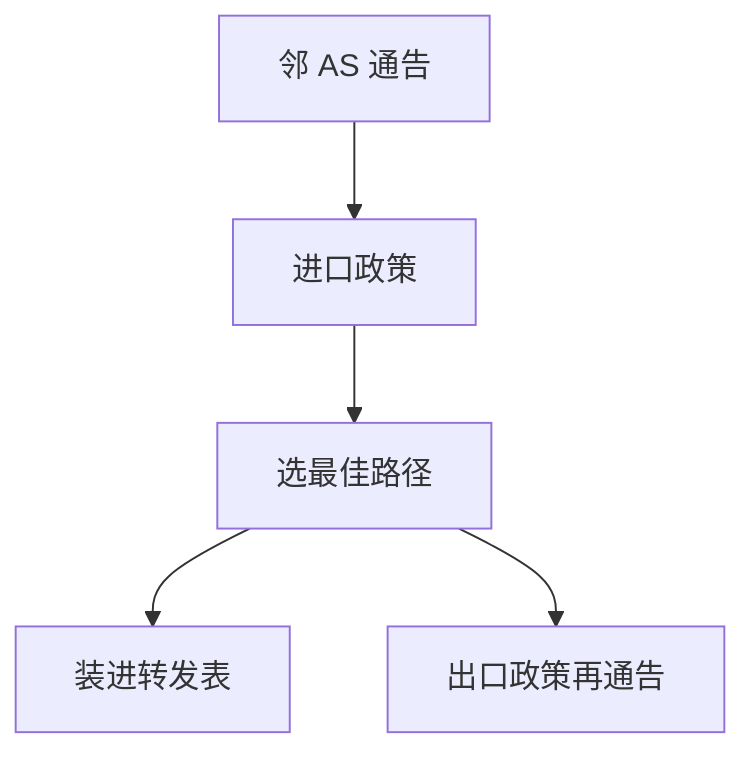

# BGP 直觉

BGP 通告的是路径与属性，不是「到目的的最小代价」；谁是客户、谁是对等，比跳数更要紧。

<footer>—— 据 Rekhter, Li and Hares, RFC 4271, A Border Gateway Protocol 4, 2006 整理</footer>

[上一课](/cs/ospf-dijkstra)在一个管理域内求最短路。互联网由许多自治系统（AS）组成，运营商不愿意把内部代价暴露给对手，也不愿意为别人的客户免费扛流量。缺口是**路径向量与政策**：BGP 直觉，不是把 Dijkstra 再跑在全球图上。

## 问题

若全球跑 OSPF，图太大，且「最短」与「合同」冲突：客户路由应优先于对等，对等优先于提供者（常见的 Gao–Rexford 直觉）。BGP：通告前缀加上 AS_PATH 等属性；收到后按政策选最佳，再决定是否向邻居通告。AS_PATH 含自己则丢弃，防环。缺口不是 LPM 硬件，而是「选什么、向谁说」。

本课不把全部属性优先级阶梯背成考试清单。

eBGP 在 AS 之间，iBGP 在 AS 之内分发外部路由。本课只要求：域间是政策，域内仍要有上一课或等价手段把下一跳变成出接口。

## 方法

会话在 TCP 上（传输课马上出现，这里先承认需要可靠字节——循环依赖用「控制平面需要可靠信道」一笔带过，实现上 BGP 确实跑在 TCP）。通告：NLRI 前缀 + 下一跳 + 路径。撤销：显式或会话断开。选路：本地政策 > AS 路径长度等，再写入 [LPM](/cs/lpm)。

## 机制

BGP 让 [NAT](/cs/dhcp-nat) 外的公网前缀能在机构间传播，也让默认路由在边缘出现。端到端：政策错误会黑洞或绕远，ICMP 与 TCP 超时是症状。与 DV 的无穷计数不同，AS_PATH 给出路径记忆。与 LS 不同，没有全球一致的边权。

本课不把泄漏与劫持写成操作手册；安全课谈 RPKI 等。

## 边界

本课不引入 BGP 共同体的全部运营惯例，不把 SDN 控制器当默认替代。也不把 Anycast DNS 的细节提前。网络层到此能把包送到主机；如何送到**进程**，下一课 UDP 端口。

MED、本地优先级、AS 路径长度构成选路阶梯的一部分；教学抓住「政策先于跳数」即可，不必背厂商默认次序的每一个并列规则。

后课默认：跨域按政策路径向量。主机上的进程复用同一 IP，靠传输层端口，下一课 UDP。

## 小结

- BGP（RFC 4271）是政策驱动的路径向量，不是全球最短路。
- AS_PATH 防环；客户/对等/提供者决定通告。
- 进程到进程的数据报是 UDP 的缺口。
- 出处：RFC 4271；Gao and Rexford 政策直觉；Kurose and Ross。
