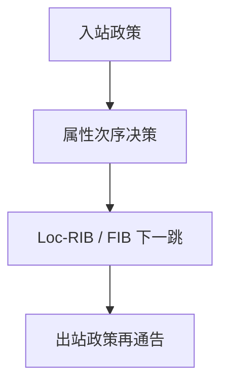

# AS 路径与策略

BGP 选出的路由先满足商业关系，再看路径属性；AS_PATH 用来防环，不是跳数最小。

<footer>—— 据 Rekhter, Li and Hares, RFC 4271；Kurose and Ross 对客户–对等–提供者的整理</footer>

[上一课](/cs/bgp-intuition)已经说：BGP 通告路径与属性，不是域内最短路。本课不重讲「为什么不用全球 Dijkstra」。缺口是决策顺序：本地偏好、AS 路径长度、MED、来源、IGP 到下一跳——以及**进出口政策**如何过滤前缀。本课不把 UDP 端口提前。

## 问题

[BGP 直觉](/cs/bgp-intuition)留下「客户、对等、提供者」。没有政策，会话只是交换前缀。典型 Gao–Rexford 直觉：向客户通告能学到的路由，向对等与提供者只通告自己的客户路由——避免成为免费中转。AS_PATH 里若已出现本 AS 则丢弃，这是路径向量对环的检测。[计数到无穷](/cs/count-to-infinity) 那种标量加一在此不适用。

LOCAL_PREF 在 AS 内比路径长度更优先。所以「绕远」可以是故意的。RFC 4271 写决策过程；商业关系是教材归纳，不是协议字段名。

## 方法

入站：按邻居类过滤、设本地偏好。决策：在可用路由里按属性次序挑一条，安装进 Loc-RIB，再按政策向其他邻居通告。出口可能改 NEXT_HOP、剥或加团体属性。同一前缀多条路径时，只有选出的那条（及可能的附加路径扩展）影响转发。

## 机制

政策把控制平面从「图上最短」改成「允许的图上可转发」。数据平面仍是 [LPM](/cs/lpm)：前缀 → BGP 下一跳 → 经 IGP 可达的接口。端到端分组不携带完整 AS 路径；路径只在控制平面防环与排障。错误政策会造成黑洞或意外中转，这是配置故障，不是 IP 转发公式错。

## 边界

本课不把 RPKI 与全部团体约定写成安全课，不引入路由泄漏的操作清单。传输层如何把分组交给进程，下一课 UDP。

后课默认：跨域路由是带路径的政策选择。主机上的进程还没有端口，下一课最薄的传输。

## 小结

- AS_PATH 防环；决策先政策后长度。
- 进出口过滤实施客户/对等/提供者关系。
- 进程到进程从下一课 UDP 开始。
- 出处：RFC 4271；Kurose and Ross。
