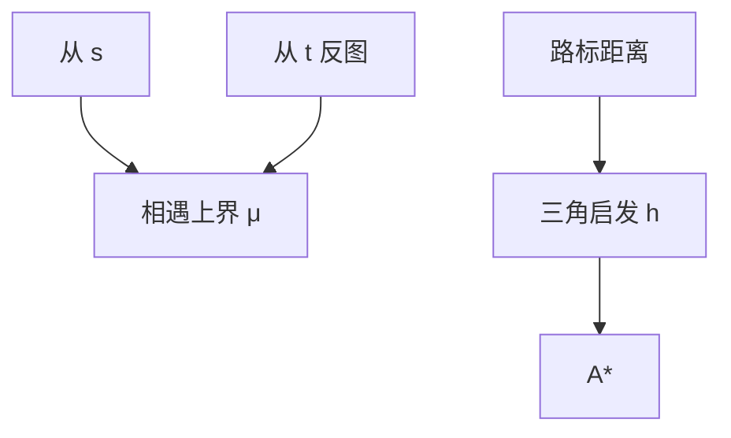

# 双向与 ALT

从 $s$ 与 $t$ 同时长最短路树，在中间相遇；ALT 用少量路标的三角不等式造可行启发，把 A* 接到路网上。

<footer>—— 据 Pohl, Bi-Directional Search, 1971；Goldberg and Harrelson, Computing the Shortest Path: A* Search Meets Graph Theory, 2005 整理</footer>

上一课[A*](/cs/a-star)要一个可采纳 $h$。路网没有曼哈顿。缺口是两件事：双向 Dijkstra/A* 减少展开；以及 ALT（A*, Landmarks, Triangle inequality）用预处理距离造 $h$。不重写一致启发的证明。后课收缩层次把预处理做进图本身。

## 问题

单向 Dijkstra 展开约以 $s$ 为心、半径 $\delta(s,t)$ 的球。双向：正图从 $s$、反图从 $t$，直到两侧键满足相遇条件（注意：最先碰到的点未必在最短路上，要维护 $\mu$ 上界并继续到终止规则）。正确终止比单向更脆，实现须照教材条件，不要「两侧一碰面就停」。

ALT：选路标 $L$。预处理 $\delta(\ell,\cdot)$、$\delta(\cdot,\ell)$。$h_t(v)=\max_{\ell}\max\{\delta(v,\ell)-\delta(t,\ell),\,\delta(\ell,t)-\delta(\ell,v)\}$ 等三角下界。可采纳。路标越多 $h$ 越紧、预处理越贵。

缺口是终止规则与路标 $h$，不是新的堆。

### 路标不是聚类中心随便一个

路标应覆盖「远」方向：避开、最远点等启发式选点。随机路标也可用，效率差。不要把路标当聚类再在类内 Dijkstra——那是另一套分区。

Pohl 1971 双向。Goldberg–Harrelson 2005 ALT（Microsoft 路网）。后课 Geisberger 等 CH 用收缩，预处理更重、查询更快。

## 方法

双向：两套优先队列，交替或按 $f$ 平衡展开，维护最佳相遇 $\mu$。ALT：离线选 $L$、全源到路标；在线 A* 用 $h$。可双向+ALT。

预处理空间 $O(|L|V)$。

## 机制

三角不等式：$d(v,t)\ge d(v,\ell)-d(t,\ell)$。取 $\max$ 仍可采纳。双向的正确性：最短路被切成两段，两段都最优时 $\mu$ 正确；过早停会漏更短组合。与单向 A*：双向不自动给出 $h$，只减展开半径。

负权仍禁止这套 Dijkstra 骨架。

## 边界

本课不写 Hub Labeling 全文。不写时间相关路网。后课默认：路网查询可双向 + 路标启发。下一课收缩层次：按序收缩顶点加捷径。

## 小结

- 双向要正确终止，不是第一次碰面。
- ALT：路标三角不等式造 $h$。
- 预处理换查询；与 CH 下一课分工。
- 出处：Pohl, 1971；Goldberg and Harrelson, 2005。
