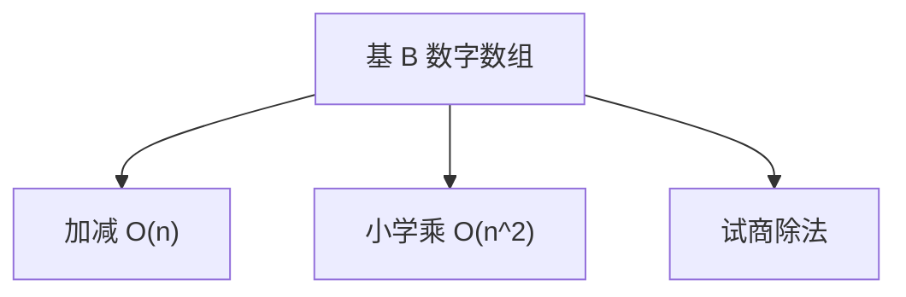

# 高精度算术

机器字装不下时，把整数当基 $B$ 的多项式；加减 $O(n)$，小学乘 $O(n^2)$，除法用规范化试商。

<footer>—— 据 Knuth, The Art of Computer Programming, 卷 2；CLRS 第 31 章整理</footer>

上一课[快速幂](/cs/fast-exponentiation)假定一次乘是 $O(1)$ 或 $O(k^\omega)$。大整数的一次乘本身随位数涨。缺口是**表示与小学算法**：基 $10^9$ 或 $2^{32}$ 的数组，符号、进位、比较。后课 Karatsuba 才拆乘。不重写模意义下的小模运算。

## 问题

$n$ 位（基 $B$ 下 $n$ 个数字）加减从低位进位，$O(n)$。乘法：每位对每位，$O(n^2)$。除法：Knuth 的规范化除（D 算法），试商，最坏每位常数次修正。比较、移位、gcd 用欧几里得，代价由除法主导。

缺口是正确进位与试商，不是 FFT。负数用符号–幅度或补码数组，全程一种。

### 基不是十进制的审美

选 $B$ 使 $B^2$ 不溢出机器字，或用宽寄存器。十进制只为 I/O。不要每位用 `char` 存 0–9 当高性能默认。

Knuth TAOCP 卷 2 是大数算术的标准出处。后课 Karatsuba $O(n^{\log_2 3})$，再后 FFT 近 $n\log n$。

## 方法

约定小端或大端。乘：结果 $2n$ 位。除法先对齐被除数。模幂：平方乘 + 本课乘。输出再转十进制。

前导零、零的符号要约定。

## 机制

进位是基 $B$ 的多项式加法。乘法是卷积，小学即朴素卷积。除法是乘法的逆，试商来自最高位估计。与浮点：大整数精确，位数由输入决定；浮点是近似。

## 边界

本课不写 Montgomery 模乘细节（密码实现）。不写任意精度浮点。后课默认：大整数 = 数组 + 小学四则；乘可被更快算法替换。下一课 Karatsuba。

## 小结

- 大整数是基 $B$ 多项式。
- 加减线性；小学乘平方；除法试商。
- 一次「乘」的代价从此不再 $O(1)$。
- 出处：Knuth TAOCP 卷 2。
