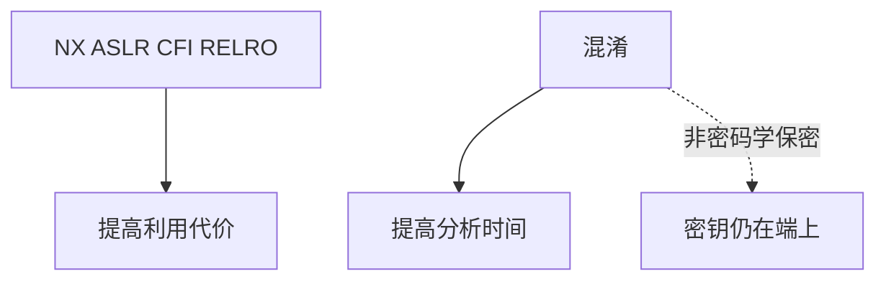

# 二进制加固与混淆

加固是让控制流劫持变贵：NX、ASLR、CFI、RELRO。混淆是让分析变贵：控制流平坦、字符串加密。前者是默认应开的合同；后者不能当秘密算法，也常被恶意软件用来拖分析员。

<footer>—— 据 Szekeres SoK 的缓解谱；Collberg 对混淆的限度；对照 GNU 硬化和 LLVM CFI</footer>

## 定位

上一课[rootkit](/cs/rootkits)说明特权下检测难。缺口是**用户态二进制自己的默认编译选项**与「靠混淆藏逻辑」的幻想。本课分清加固与混淆，不教反调试对抗。

后课默认已经读完本课钉下的合同，只补差，不从该领域第一性原理重开。

## 问题

发行构建若关 PIE/NX，利用课的开口回来。混淆不增加密码学假设，只增加逆向时间；密钥仍在端上。缺口是发布清单：该开的缓解、不该指望的秘密。

### 恶意软件也混淆

分析员要用沙箱与内存转储，而不是假设混淆等于不可分析。

Collberg：混淆没有密码学意义上的一般不可破解。本课禁止写商业软件保护绕过教程。

## 方法

列加固开关（PIE、Fortify、CFI）。对照混淆：可作知识产权延迟，不可作唯一控制。软件安全单元封口，下一单元 Web。

图中节点是本课的机制骨架；课程不把图展开成可运行的攻击步骤。

## 机制

发现与工程课序结束于「如何发行」。Web 单元从 XSS 起：解释器在浏览器里，洞的形状换成脚本注入。

前提写进合同之后，游戏外的误用只当失败模式点名，不在本课写成操作程序。

## 边界

本课不给脱壳步骤。下一单元第一课 XSS。

## 小结

- rootkit 在特权层；用户态仍要开加固。
- 混淆拖时间，不是 Shannon 保密。
- 发行清单对准缓解，不对准秘密算法。
- 下一单元：XSS。
- 出处：Szekeres et al.；Collberg；GNU hardening / LLVM CFI。
