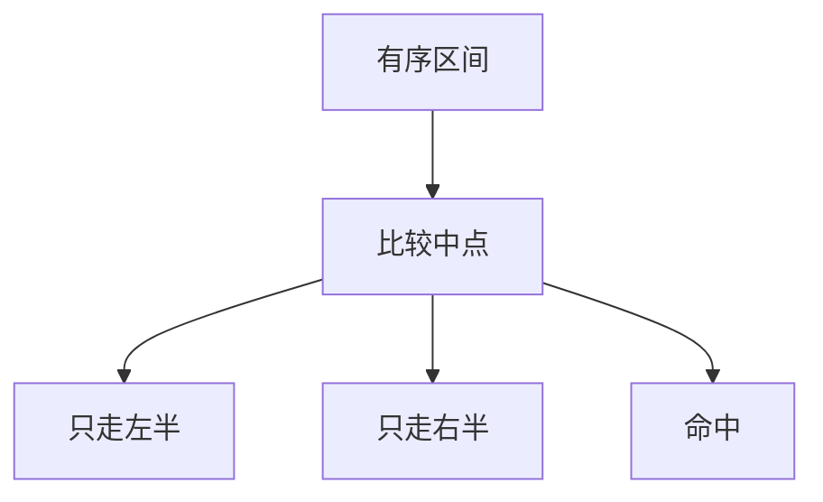

# 二分查找

有序数组上每次丢掉一半；比较次数 $\Theta(\log n)$，合并是常数，分治退化成单侧。

<footer>—— 据 Knuth, TAOCP vol. 3；CLRS 第 2 章整理</footer>

上一课[分治](/cs/divide-conquer)钉了分解–递归–合并，并用[主定理](/cs/master-theorem)读 $T(n)=aT(n/b)+f(n)$。本课不重写三步定义。缺口是一份最瘦的实例：有序数组里找键，切成两半后**只走一侧**，合并是 $\Theta(1)$。后课插入与归并才对照「循环扩前缀」和「两半都递归」。本课只把二分钉成有序上的分治。

## 问题

无序数组找键只能线性扫。若已按[比较](/cs/sort-lower-bound)排好，中点一次比较就能丢掉一半：目标小于中点则右半不可能，反之左半不可能。递归式 $T(n)=T(\lfloor n/2\rfloor)+\Theta(1)$，主定理情形二的退化，$\Theta(\log n)$。缺口不是再证明有序，而是承认：**分治不必两半都解**；信息在比较里，另一半被谓词杀掉。

循环写法维护区间 $[L,R)$，不变式「若存在则在区间内」。递归与循环同一逻辑；本课两者都认，不把栈当必需。

### 有序是前提，不是本课的产物

二分不排序。把无序数组先排再找，代价被排序主导，不是本课的 $\log n$。相等键：返回任一、最左或最右，是边界约定，要在不变式里写清，不能靠「看起来中间那个」。

Knuth 把二分当作有序表上的标准检索。CLRS 用它练循环不变式与递归式。后课排序算法才生产有序；本课消费有序。

## 方法

取中点 $m$。比较 $A[m]$ 与目标：相等结束；小于则 $L\leftarrow m+1$；大于则 $R\leftarrow m$。空区间则失败。正确性：每次区间真缩小，且答案若在原区间则仍在。代价：$\lfloor\log_2 n\rfloor+O(1)$ 次比较。

不要对无序数组「二分」：中点没有丢掉一半的权利。也不要把树的检索（[BST](/cs/bst)）与数组下标中点混成同一实现；前者走指针，后者是随机访问。

## 机制

[数组随机访问](/cs/array-random-access)让中点 $\Theta(1)$。链表上中点要走 $\Theta(n)$，二分失去意义。整数溢出：$(L+R)/2$ 在定长整数上可能爆；用 $L+(R-L)/2$。这是编码细节，不改变渐近。

下界：比较模型里检索有序表也要 $\Omega(\log n)$ 次，决策树高度。本课点名，完整排序下界仍后置。

## 边界

本课不排。不处理插值检索、指数检索、旋转数组上的变体。也不把二分答案（对单调谓词搜阈值）写成数值算法附录。后课默认：有序数组检索 $\Theta(\log n)$ 比较。插入与归并对照循环与两路分治。

后课默认：谈到有序表上的找，先二分。全表排序从下一课开始。

## 小结

- 有序数组上分治只走一侧，$T(n)=T(n/2)+\Theta(1)=\Theta(\log n)$。
- 不变式管区间；无序或链表使方法失效。
- 本课不生产有序，只消费有序。
- 出处：Knuth, TAOCP vol. 3；CLRS 第 2 章。
