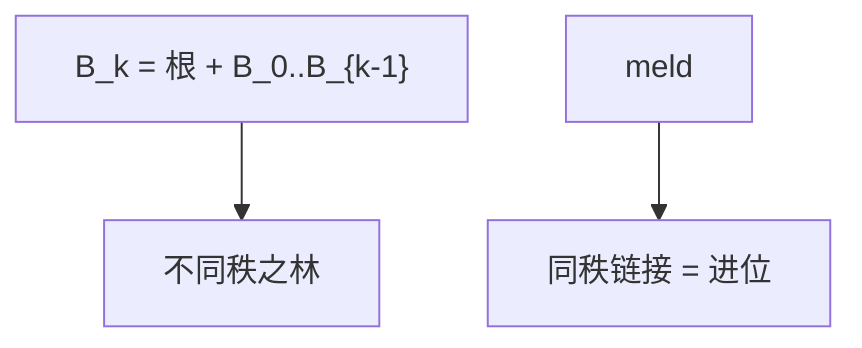

# 二项堆

一棵二项树 $B_k$ 有 $2^k$ 个节点；堆是不同秩的 $B_k$ 之林，合并像二进制加法进位。

<footer>—— 据 Vuillemin, A Data Structure for Manipulating Priority Queues, CACM 1978；Cormen, Leiserson, Rivest and Stein 整理</footer>

[上一课](/cs/fibonacci-heap)用懒合并与标记换摊还 $O(1)$ 减键。要理解「按度数合并」，更干净的模型是二项堆：每秩至多一棵，meld 最坏 $O(\log n)$。本课不级联割。缺口是 Vuillemin 二项堆：形状由二进制唯一决定。

## 问题

$B_0$ 单节点；$B_k$ 是一个根挂上 $B_0,\ldots,B_{k-1}$（或两个 $B_{k-1}$ 按堆序链接）。节点数 $2^k$。二项堆 = 一组根，秩互异，各满足堆序。$n$ 的二进制里有几个 1，林里就几棵树。meld：从小秩到大秩，同秩两棵链接成秩 $+1$，与加法进位相同。缺口是**把可并堆做成二进制计数器**，分析不必斐波那契。

CLRS 第 19 章先讲二项再讲斐波那契。insert 是 meld 一个 $B_0$，摊还可 $O(1)$，最坏 $O(\log n)$。

## 方法

find-min：扫根表 $O(\log n)$ 棵。extract-min：摘最小根，其孩子是较小秩的二项堆，与剩余 meld。decrease-key：上滤，与二叉堆同，最坏 $O(\log n)$，没有 Fib 的 $O(1)$ 摊还。

与左偏：二项形状更死、证明更短；左偏树高也对数但不是 $2^k$ 块。与 Fib：Fib 允许同秩多棵（根表懒），consolidate 才压成类似二项。

## 机制

链接：键大的根做键小的根的新孩子，秩加一。孩子表通常按秩有序，extract-min 时反转孩子链即可得合法二项堆。这是后课「可并堆 ADT」的标准实现之一。

## 边界

本课不把斜二项、或 Brodal 堆写进来。decrease-key 不是本结构的强项——那是 Fib 的动机。下一课把 meld/insert/extract-min/decrease-key 收成一张合同表，对照已出现的实现。

后课默认：按秩合并的林就是二项堆图像。可并堆 ADT 与表示分离。

## 小结

- 二项堆：二进制形状的可并堆，meld 如进位。
- 减键 $O(\log n)$，不如 Fib 摊还。
- 下一课把可并堆合同钉死。
- 出处：Vuillemin, *CACM*, 1978；Cormen et al.。
