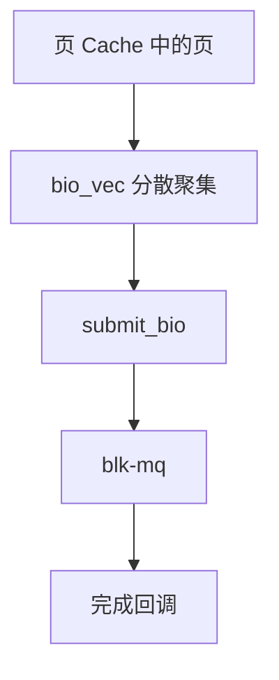

# bio

bio 描述一次块 I/O：目标设备偏移、方向、以及一组页加页内偏移的分散聚集列表。

<footer>—— 据 Bovet and Cesati 对 Linux bio 的叙述；Tanenbaum 对块设备接口的整理</footer>

[上一课](/cs/blk-mq)有了队列，还没有请求长什么样。[页缓存](/cs/page-cache) 里的页不一定物理连续，也不一定整页对应整块。[VFS](/cs/vfs) 的 `readpage`/`writepages` 必须把「这些帧」交给块层。缺口是 **bio**：与文件系统布局无关的块 I/O 描述符。

## 问题

若驱动只接受单段连续物理缓冲，页 Cache 每次都要 bounce。缺口：bio 持有 bio_vec 数组（页、偏移、长度），扇区起点，读或写，完成回调。块层可把 bio 合并进更大的 request，或拆到设备限制。文件系统不谈门铃寄存器；驱动不谈 inode。下一课 DMA 才把 vec 变成总线地址。

本课不把每个 `bi_opf` 标志背完。

一个 writepages 可能提交多个 bio。完成回调在下半部上下文：清页锁、结束缓冲、唤醒 fsync 等待者。

## 方法

ext4 等：把脏页填进 bio，指向该 inode 的块号（经 bmap），`submit_bio` 进 blk-mq。设备完成：回调标记页最新或错误。用户 `read` 的拷贝发生在页已 uptodate 之后，不是 bio 里直接指向用户缓冲（Direct I/O 例外，本课点名即可）。

## 机制

bio 是 FS 与设备之间的契约：字节在页里，位置在扇区里。它让 [按需调页](/cs/demand-paging) 的 major 缺页与 writeback 走同一提交函数。不要把 bio 写成 SCSI CDB 百科。错误向上变成 `read` 的 EIO 或映射文件上的信号，接口裂缝在 mmap 课已点过。

## 边界

本课不引入 multi-page folio 的全部改名。不保证所有驱动支持任意长度的 vec。下一课：设备如何按物理地址搬这些页——PIO 与 DMA。

后课默认：块请求已是页的分散聚集。控制器成为总线主设备，下一课 I/O 与 DMA。

## 小结

- bio 用页向量描述块读写，对接页 Cache 与 blk-mq。
- 完成走回调；FS 与驱动在此分界。
- 搬动物理字节是 DMA 课的缺口。
- 出处：Bovet and Cesati, *ULK*；Tanenbaum *MOS*；Linux block 层文档。
