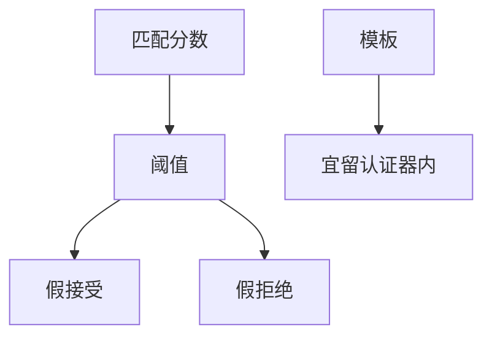

# 生物识别 FAR / FRR

生物识别是测量不是口令：假接受率与假拒绝率对调，阈值决定你把谁当成谁。模板泄漏不可像口令那样作废再选一个新拇指。

<footer>—— 据 Jain, Ross and Prabhakar 对生物识别的综述；NIST 生物识别测试报告；对照 800-63B 对生物作为因素的限制</footer>

## 定位

上一课[密码破解](/cs/password-cracking)还能轮换秘密。缺口是**身体测量**：FAR（陌生人当本人）与 FRR（本人被拒）。WebAuthn 课已说模板宜留在认证器；本课定量直觉。

后课默认已经读完本课钉下的合同，只补差，不从该领域第一性原理重开。

## 问题

口令相等比较是精确的。生物是分数与阈值。人口大时，即使很小的 FAR 也会产生假匹配。缺口是错误率与威胁模型（呈现攻击、模板存储），不是传感器电路。

### 不可作废

种子可换，指纹难换。泄漏的模板要当长期凭证事故，配合设备密钥与衰减。

ISO/IEC 19795 测试方法点名。本课不写欺骗传感器的步骤。PAD（呈现攻击检测）只当需求点名。

## 方法

画 ROC：阈值左移 FAR 降、FRR 升。对照：解锁手机是本机一对一；一对多识别是另一游戏。服务器不要收原始模板。

图中节点是本课的机制骨架；课程不把图展开成可运行的攻击步骤。

## 机制

MFA 里生物常是「本地解锁认证器」，服务器只看见 WebAuthn 成功。把生物当远程共享秘密会复制口令问题且更难轮换。下一课用形式工具看协议：ProVerif/Tamarin。

前提写进合同之后，游戏外的误用只当失败模式点名，不在本课写成操作程序。

## 边界

本课不评某厂商 FAR 广告数字。协议形式化下一课。

## 小结

- 口令可轮换；生物是带错误率的测量。
- FAR/FRR 随阈值对调；大规模一对多更险。
- 模板宜留在认证器，配合 WebAuthn。
- 下一课：协议形式化。
- 出处：Jain, Ross and Prabhakar；NIST 生物识别评估；NIST SP 800-63B。
