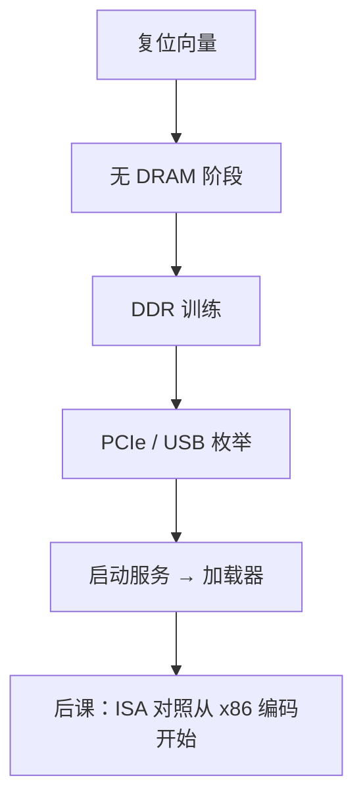

# 固件：BIOS 与 UEFI

  
复位后最先跑的不是内核：固件在 SPI 闪存里，训练 DRAM、枚举 PCIe、提供启动服务，再把控制交给引导加载器。

  <footer>—— 据 UEFI Specification；Intel, PCI Firmware Specification 实践；Patterson and Hennessy, Computer Organization and Design 整理</footer>

[上一课](/cs/framebuffer-display)的 GOP 由固件提供。[早期启动](/cs/early-boot)从引导加载器之后讲内核。缺口是更早的 **BIOS/UEFI**：CPU 复位向量指向只执行闪存，如何变成「有 DRAM、有设备、能读盘」。

## 问题

复位：[复位策略](/cs/reset-strategy)后 PC 在复位向量（x86 在高地址别名）。此时 DRAM 未训练，只能用 SRAM/Cache-as-RAM。固件：FSP/AGC 一类训练 [DDR](/cs/ddr-protocol)，按 [BAR](/cs/pcie-tlp-bar) 枚举，用 [SPI](/cs/i2c-spi-uart) 读自己，安装 UEFI 启动服务（磁盘、GOP、时间）。传统 BIOS 用 16 位中断调用；UEFI 用表与协议。缺口不是内核 `start_kernel`，而是这条**硅启动链**。

Secure Boot：用密钥验引导加载器，点名，安全课再深。ACPI 表描述 APIC、HPET、NUMA，交给 OS。

### UEFI 不是操作系统

退出启动服务后多数固件驱动消失，运行时服务子集留下（变量、时间）。把 UEFI 当小型 Linux，设备驱动模型会错。BIOS 调用在长模式下不可用，故现代 OS 依赖 UEFI/ACPI 或设备树。

UEFI 规范是主文献。PCI Firmware Spec 讲枚举。Patterson/Hennessy 的复位启动在 x86 上具体化为本课。核心启动（coreboot）是另一实现，合同类似。

## 方法

SEC/PEI：CAR、内存训练。DXE：驱动、协议。BDS：启动策略、选盘、链加载。SMM：高特权运行时黑洞，本课承认存在。RISC-V：OpenSBI/BOOTROM 扮演类似角色，无 16 位 BIOS。

内存与 I/O 单元到此：从 bank 到固件把接口交给软件。下一单元对照 x86/ARM/RISC-V 的指令与 ABI 边界。

## 机制

OS 接手后仍通过 ACPI/UEFI 运行时改启动项、读变量。DMA 与 IOMMU 常在 OS 里才开，固件阶段需谨慎。本课封上 I/O 课序：协议与启动已经能接到内核课已有的早期启动。

## 边界

本课不写 CSM 兼容细节全书，不把 ME/PSP 固件引擎当主体。不讨论刷机变砖流程。不进入许可密钥。

后课默认：复位后固件训练内存并枚举 PCIe；UEFI 启动服务把内核装进来。

## 小结

- 固件先于内核：训练 DRAM、枚举、启动服务。
- BIOS 中断 vs UEFI 协议；ACPI 描述平台。
- I/O 单元收束；下一课 x86-64 编码。
- 出处：UEFI Specification；PCI Firmware Spec；Patterson and Hennessy, COD。
