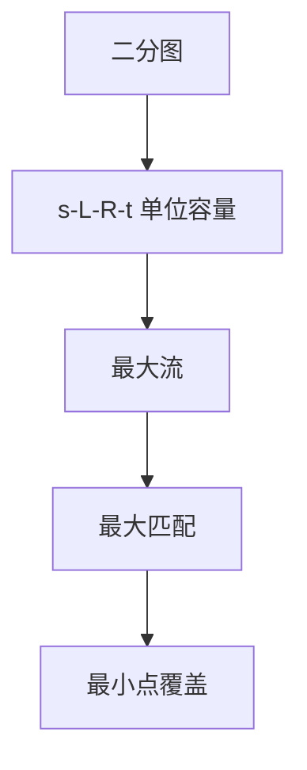

# 二分图匹配

最大匹配等于最小点覆盖；单位容量网络上最大流给出最大匹配。

<footer>—— 据 König, 1931；Hopcroft and Karp, An $n^{5/2}$ Algorithm for Maximum Matchings in Bipartite Graphs, 1973；CLRS 第 26.3 节整理</footer>

上一课[Edmonds–Karp 与 Dinic](/cs/dinic)把最大流变成多项式增广。本课不重写分层。缺口是组合对象**匹配**：边子集、任意点至多关联一条。二分图 $G=(L\cup R,E)$ 上，最大基数匹配等于以 $s\to L\to R\to t$、边容量 $1$ 的最大流。König：最大匹配 = 最小点覆盖。后课离开图，进入串。

## 问题

贪心随便取边得不到最大。交错路：从自由点出发，非匹配/匹配交替，增广路定理（Berge）说匹配最大当且仅当无增广路——与残量 $s$–$t$ 路同一图像。构造网络：超源连 $L$ 容量 $1$，$R$ 连超汇容量 $1$，原边 $L\to R$ 容量 $1$。整流对应匹配。缺口是这层翻译，不是再证最大流最小割。

Hall 条件：对任意 $S\subseteq L$，$|N(S)|\ge|S|$ 当且仅当存在饱和 $L$ 的匹配。本课点名，不把婚配定理证完。

### 一般图不是本课

带花的 Edmonds 算法处理非二分；本课只二分。不要把「每次找一条交错路」在奇环上当多项式显然。

König 定理是二分图上最大匹配/最小覆盖的对偶。Hopcroft–Karp 1973 一次找一组最短增广，时间 $O(E\sqrt V)$，与单位容量 Dinic 同类。CLRS 26.3 用流做匹配。

## 方法

建单位网络，跑上一课的最大流。匹配边即 $L\to R$ 上流量为 $1$ 的边。最小点覆盖：最大流后残量里 $s$ 可达的 $L$ 与不可达的 $R$ 等标准构造，本课认「覆盖数等于匹配数」，不手画全部情形。

匈牙利算法是交错路的直接实现，与单位流增广等价。本课以流为接口，避免两套术语。

## 机制

整数容量保证整流。多源任务分配：左边人、右边岗位，即本课。权匹配（KM / 费用流）不在本课。也不要把 MST 的边集当匹配：度数可以大于 $1$。

[DFS 边分类](/cs/dfs-edge-types)的交错路是这条图上的路径，不是 DFS 森林的四类边。

## 边界

本课不做一般图匹配、不做稳定婚配的 Gale–Shapley。后课默认：二分最大匹配 = 单位最大流，基数多项式可算。串匹配是另一类对象：文本与模式，不是点对边。

## 小结

- 二分最大匹配 ↔ 单位容量最大流。
- 最大匹配 = 最小点覆盖（König）。
- 一般图带花，不在本课。
- 出处：König；Hopcroft and Karp, 1973；CLRS 第 26.3 节。
