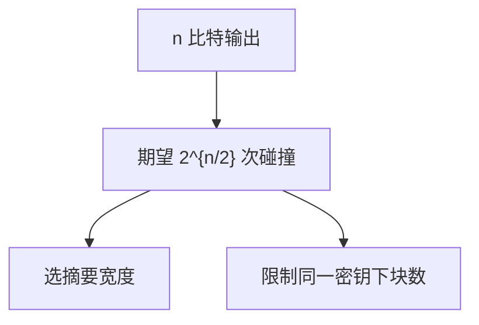

# 生日攻击

在 $n$ 比特摘要上，随机尝试大约 $2^{n/2}$ 次就期望撞上碰撞。这不是实现 bug，是鸽笼的定量形式；签名哈希与分组大小都要按这个界留余量。

<footer>—— 据鸽笼原理与随机映射的碰撞统计；Katz and Lindell；对照 van Oorschot and Wiener 的并行碰撞搜索</footer>

## 定位

上一课[HMAC](/cs/length-extension-hmac)关掉长度扩展。主干[哈希与碰撞](/cs/hash-collision)已点名生日界。缺口是**定量**：为何 128 比特碰撞边际不够当长期签名哈希，以及这与「原像 $2^n$」不是同一条轴。不给寻找碰撞的程序。

后课默认已经读完本课钉下的合同，只补差，不从该领域第一性原理重开。

## 问题

HMAC 假设底层哈希仍抗碰撞。若 $H$ 输出 $n$ 比特，生日悖论给出碰撞代价 $\sim 2^{n/2}$。MD5 的 128 比特在分析下更早垮掉；即使理想随机函数，64 比特块密码的生日也限制密文量（如 3DES 的 Sweet32 一类观察）。缺口是把平方根界钉进参数选择。

### 碰撞≠原像

给定 $y$ 找原像仍约 $2^n$。签名伪造更常吃碰撞或第二原像，取决于敌手能否选消息。

Katz–Lindell 的哈希定义把碰撞优势写成游戏。本课不复述某公开碰撞示例的构造步骤。

## 方法

用 $n$ 人中两人同生日的直觉过渡到 $2^{n/2}$。列出：哈希输出宽、分组大小、RNG 的状态碰撞。参数：SHA-256 的碰撞边际对今日签名够用；128 比特摘要不当新签名默认。

图中节点是本课的机制骨架；课程不把图展开成可运行的攻击步骤。

## 机制

计算安全要写清敌手查询次数。生日界是通用攻击，不依赖弱轮函数。它解释为何 AES 块 128 仍要限制数据量、为何 SHA-1 的 160 比特在碰撞轴上被放弃。

前提写进合同之后，游戏外的误用只当失败模式点名，不在本课写成操作程序。

## 边界

本课不进入量子 Grover/BHT 的定量作业。公钥侧下一课 RSA：把哈希用进填充方案 OAEP，碰撞界变成填充安全的前置。

## 小结

- HMAC 仍要底层抗碰撞；碰撞代价是平方根。
- 输出宽与块大小都按 $2^{n/2}$ 留余量。
- 碰撞轴与原像轴分开记账。
- 下一课 RSA 与 OAEP：填充把哈希接进公钥加密。
- 出处：Katz and Lindell；van Oorschot and Wiener；对照 NIST 对 SHA-1 的弃用。
