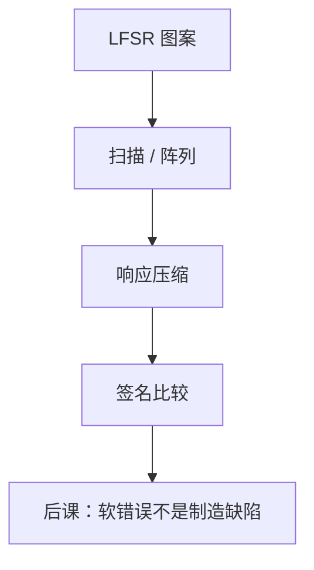

# 内建自测 BIST

  
ATE 带宽和向量存储有限；片上用伪随机图案生成器刺激扫描链或存储器，压缩响应成签名，上电或现场也能自检。

  <footer>—— 据 Bushnell and Agrawal, Essentials of Electronic Testing；IEEE Std 1149.1；Hennessy and Patterson, CA:AQA 整理</footer>

[上一课](/cs/dft-scan-chain)把 FF 串成链，向量仍常来自片外 ATE。大芯片扫描数据量与引脚速率成为测试成本。缺口是 **BIST**：图案生成（LFSR）与响应压缩（MISR）放进硅里，ATE 只启动并读签名。

## 问题

逻辑 BIST：LFSR 灌扫描链，若干捕获周期，MISR 压输出。存储器 BIST：对 SRAM/DRAM PHY 旁的阵列走 March 算法，覆盖固定与转换故障。缺口不是再解释扫描 MUX，而是**片上控制器**与签名黄金值。随机图案对随机逻辑覆盖尚可，对规则算术可能要混合确定向量。

现场自检（上电、高可靠系统）让 BIST 超出工厂 ATE。航空与汽车安全标准会要求，本课点名不背条款。

### 签名通过不是「无故障」

压缩有别名：两个响应可能同一签名。LFSR 多项式与 MISR 宽度降低别名概率，不是零。把 BIST 绿勾当成形式证明，与 LEC 课的警告同类。

Bushnell/Agrawal 专章 BIST。存储器 March 测试是工业常规。CA:AQA 把可靠性与检测作为系统问题。本课不写具体 LFSR 抽头表。

## 方法

LBIST：测试时钟下运行 $N$ 周期，比较 MISR。MBIST：地址计数器 + 数据背景（5/A、棋盘）。与 JTAG：TAP 指令启动 BIST、读状态。与[时钟门控](/cs/clock-gating-dvfs)：BIST 模式强制时钟开。功耗：伪随机高翻转，须降速或分块跑。

DRAM 后面单元有自己的维修与 BIST，与逻辑 BIST 分家。

## 机制

下一课软错误是运行期辐射翻转，不是制造 stuck-at；BIST 上电能抓部分硬缺陷，抓不住随机位翻转——那要 ECC。老化可能让时序边沿在现场失败，BIST 定期跑可当健康检查，覆盖仍有限。

## 边界

本课不把模拟环路 BIST（ADC）写完，不讨论加密密钥是否被 BIST 路径泄漏（安全课另开）。不把软件 memtest 当 MBIST。

后课默认：BIST 用片上 LFSR/MISR 或 March 降 ATE 成本；签名有别名；软错误要另一套。

## 小结

- 扫描解决可控可观；BIST 把向量发生与压缩搬进芯片。
- 逻辑用 LFSR/MISR，存储器用 March。
- 通过 ≠ 无故障；现场可复用。
- 出处：Bushnell and Agrawal；IEEE 1149.1；Hennessy and Patterson, CA:AQA。
