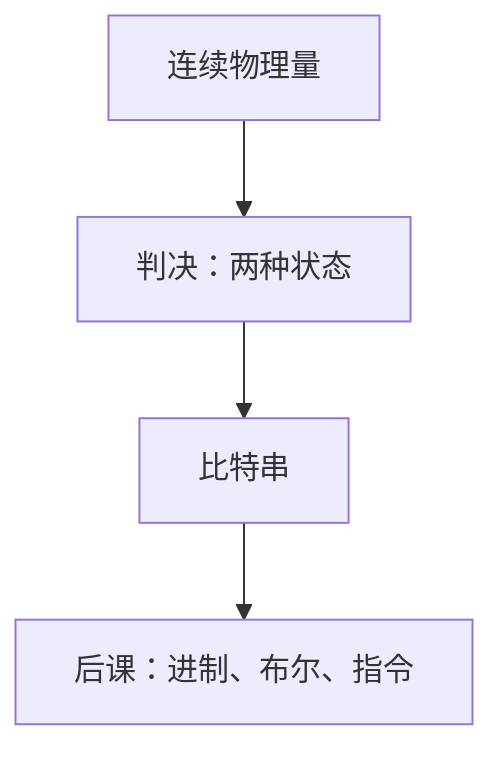

# 比特作为区分

信息是使两个可分辨状态不再相同的那种差别；没有事先约定的区分，后头的数、指令和报文都没有落点。

<footer>—— 据 Shannon, A Mathematical Theory of Communication, 1948；Bateson, Steps to an Ecology of Mind, 1972 整理</footer>

本课是计算机栏的第一课。后面的进制、补码、门电路、指令和协议，都默认你会「有两种可分辨状态，并且给它们编了号」，不再从「计算机是什么机器」讲起。大模型栏的[离散符号](/llm/token-as-discrete-unit)假定词表已经存在；本栏要先问：任何可编号的对象，底下那一层区分从哪来。后课默认已经读完本课。

## 问题

物理世界里电压、电荷、凹坑、磁畴都是连续的。若直接在连续量上谈「算」，加法和存储都没有稳定的相等关系：噪声会把两个「差不多」的量搅在一起。缺口因此不是算术，而是先约定一套**区分**：把世界切成有限个互斥状态，使得「这是哪一个」可以回答，并且答案在噪声容限内可重复。

最小的非平凡区分是两个状态。记它们为 $0$ 和 $1$，一个这样的位置叫做比特。有限个比特排成向量，才有后课的位权、补码和指令字。本课只钉「必须先有可分辨的二元状态」；进制怎么读、溢出怎么定义、门怎么实现，都是后课留下的缺口。

### 比特不是电压，也不是「真」

日常把 1 当成高电平或逻辑真。在本栏里，比特是约定：哪一侧叫 $1$，由编码决定，不由物理。同一根线上，TTL 与 CMOS 的阈值不同，但只要接收方能把模拟量收成两个符号，上层就只看见比特。真值是后课布尔代数才引入的解释，本课连「与、或」都还没有。

Shannon 把通信写成：发送端从有限消息集合里挑一个，接收端要复现那一次挑选。比特是这个集合大小取 $2$ 时的单位。Bateson 的「造成差异的差异」是同一层直觉，不是另一套算术。

## 方法

约定字母表 $\Sigma=\{0,1\}$。一个长度为 $n$ 的比特串是 $\Sigma^n$ 中的元素，一共 $2^n$ 种。任何有限对象——十进制数字、字符、后课的操作码——只要能嵌入某个 $\Sigma^n$，就可以被存储和比较。嵌入本身是编码，本课不选哪一种编码，只要求：**先有串，再谈串的读法**。

噪声下要能恢复符号，发送和接收必须共享判决规则：把连续观测映射回 $\Sigma$。判决错了就是比特翻转，后课的纠错码才处理；本课只承认翻转会发生，不引入汉明距离。

## 机制

有了比特，相等才是离散的：两个串要么每一位都同，要么至少一位不同。复制、存储、比较都可以写成对 $\{0,1\}$ 的操作，而不必知道底下是电容还是凹坑。后课的门电路把这些操作做成电压上的函数；本课不把晶体管请进来，否则第一课会变成器件物理。

比特串的长度 $n$ 决定可指称的对象个数。$n$ 不够，后课的指令格式就写不下操作码和寄存器号；$n$ 有冗余，才谈得上检错。长度本身是资源：存储、总线宽度、后课 Cache 的块大小，都从「一次搬多少比特」起算。

## 边界

本课不解释半导体，不引入时钟，不把比特等同于信息量。Shannon 熵是[后课](/cs/entropy-bits)在概率模型上才定义的；这里只有符号，没有分布。也不把比特当成「最小的数」：数的位权、符号位、补码，下一课才出现。大模型栏的 token 是另一套有限字母表，粒度粗得多；本栏不把词表当第一课。

后课默认：谈到寄存器、内存字、报文和磁盘块，它们的内容都是比特串。读法（无符号、补码、浮点、字符）由当时的编码约定给出，而不是物理给出。

## 小结

- 计算机栏的原始对象是可分辨的二元状态，不是十进制算术，也不是「一台电脑」。
- 比特串使相等、复制和编号成为可能；连续量必须先被判决。
- 编码、进位、布尔和电路都是后课的缺口。
- 出处：Shannon, *A Mathematical Theory of Communication*, 1948；Bateson 对「造成差异的差异」的表述。
