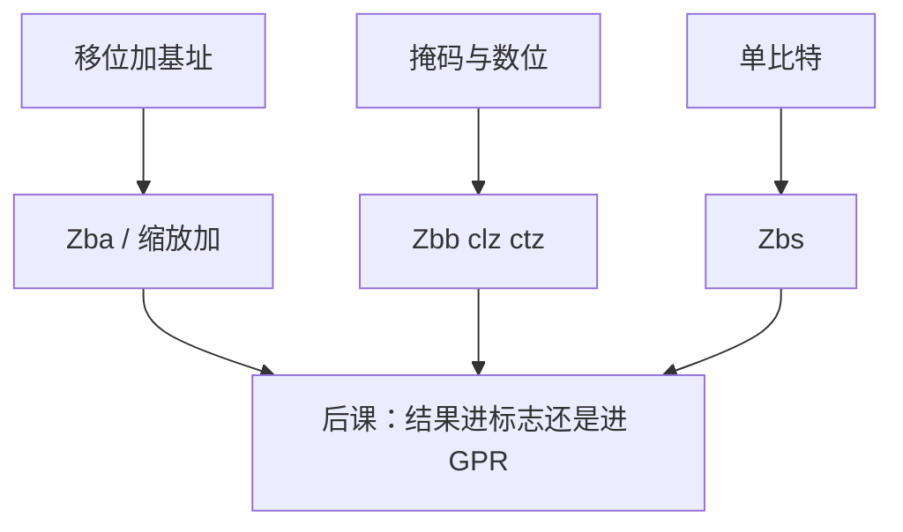

# 位操作扩展

  
移位、掩码、数前导零本可用基础整数凑出来；B 扩展与 BMI 把高频序列收成一条，地址缩放和位域插入不再占用半个循环。

  <footer>—— 据 RISC-V Bit-Manipulation ISA-extensions；Intel SDM（BMI1/BMI2）；ARM ARM；Patterson and Hennessy, Computer Organization and Design 整理</footer>

[上一课](/cs/riscv-h-extension)补完特权两层翻译。用户态加法与移位仍停在 [整数指令](/cs/riscv-int-isa)。缺口是 **位操作扩展**：RISC-V `Zba`/`Zbb`/`Zbs`、x86 BMI、ARM 位域，而不是再讲分页。

## 问题

编译器把 `a[i]` 写成 `base + i<<2`：RV32I 要移位再加。`Zba` 的 `sh2add` 一条完成。数前导零在 [LZC](/cs/lzc-normalize) 的浮点规格化里出现过，整数侧对应 `clz`/`ctz`/`cpop`（`Zbb`）。单比特置/清/测是 `Zbs`。缺口不是「位运算是什么」，而是**哪些序列被提升为 ISA**，以免软件永远用移位库冒充。

x86：BMI1（`andn`、`tzcnt`、`blsr`）与 BMI2（`pext`/`pdep`、`shlx`）。ARM：`UBFX`/`SBFX`/`BFI`、`RBIT`、`CLZ`。对照课要能指到这组名字。

### 位操作不是加密课、也不是量化权重量化

进位无关乘法 `clmul`（`Zbc`）给 CRC 与有限域，本课点名即止，不进入密码协议。[光刻](/litho/em-wave-index) 与金融栏不收这些助记符。把 BMI 写成「大模型推理内核」，CS 栏失焦。

RISC-V Bit-Manip 规范分 Zb* 子集。Intel SDM 卷 2 的 BMI。ARM 位域指令在 A64。本课不抄 opcode 图。

## 方法

软件：编译器在 `-march` 含 B/BMI 时选新指令，否则降级为移位序列；ABI 要标明扩展，否则目标文件在旧核上非法指令。`rev8` / `orc.b` 服务大小端与字符串探测，后课 endian 会引用。`min`/`max` 无分支比较可减少[条件码](/cs/condition-codes-predication) 压力。

与 [SIMD](/cs/simd-extensions)：打包移位是通道上的同类操作；本课是标量 GPR。RVV 有向量位操作，宽度故事已在向量课。

## 机制

H 扩展不改变这些编码。压缩课的 16 位别名覆盖不到全部 B 指令，多数仍是 32 位。下一课条件码：x86 几乎每条 ALU 都写 EFLAGS，RISC-V 的 `clz` 只写 GPR——谓词与分支如何接上这些结果，是对照轴上尚未钉住的缺口。

## 边界

本课不列 `Zb*` 全表，不保证某 MCU 实现了 B。不把 `pdep` 的棋盘hack 当作业。不进入 GPU 的 ballot。

后课默认：地址缩放、前导零、单比特是 ISA 扩展而不是库循环；RISC-V 用 Zb 子集，x86 用 BMI。下一课条件码与谓词。

## 小结

- `Zba`/`Zbb`/`Zbs` 与 BMI/位域把高频位序列收成指令。
- 与虚拟化正交，与 SIMD 通道正交。
- 结果是否进条件码，下一课。
- 出处：RISC-V Bit-Manipulation spec；Intel SDM；ARM ARM；Patterson and Hennessy, COD。
