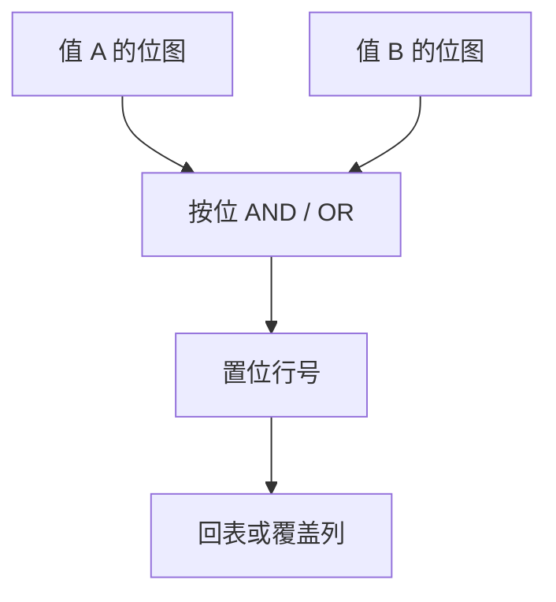

# 位图索引

每个值一条位向量，行号对位；AND/OR 做谓词交并，扫描变成位运算，适合低 NDV 的分析列。

<footer>—— 据 O'Neil 位图索引；Wu, O'Neil 等压缩位图；Ramakrishnan and Gehrke</footer>

[上一课](/cs/zone-maps)用粗摘要跳过区。本课不维护 min/max。缺口是低基数列（国家、状态、日期天）上的精确过滤：B+ 叶子对每个键挂 RID 列表，列表很长时交谓词要排 RID。位图：值 $v$ 对应长度为 $N$ 的位向量，第 $i$ 位表示行 $i$ 是否取 $v$。

## 问题

NDV 高（主键）则位图张数爆炸、几乎全 0，不如 B+。NDV 低则向量少，压缩后（Roaring、BBC、WAH）更小。多谓词：`color=red AND size=L` 是两向量 AND，再从置位取行。缺口是**只读或追加型分析表**上维护便宜；OLTP 频繁改行则要改多张向量，写放大差。

NULL 单独一向量。与连接：星型后课可用位图做维表过滤再探事实表。本课单表过滤。

Patrick O'Neil 位图索引工作。压缩位图让稀疏也可接受。本课不把位图当全文倒排——倒排下一课，键是词项不是低 NDV 维值。

## 方法

建：全表扫，为每个值置位。查询：取向量、位运算、解码 RID。与 zone：先 zone 跳区，区内再位图或再扫。向量化：把置位转成选择向量。

维护：原地更新翻比特；插入追加位。删除可翻或延迟与 vacuum 一起重建。MVCC：位图必须对应某一行版本集合，否则看见幽灵——常对只读副本或物化快照建位图。

## 机制

优化器：位图扫描代价 ≈ 向量体积 + 置位密度 × 回表。选择率估错会低估回表随机 I/O。覆盖：若查询列都在别处，可能只定位行号。

并行：按行号分段切向量。exchange 传位图段比传行宽。

## 边界

本课不讲倒排词表。也不把位图连接索引（join index）写完，只点名星型可用。学习索引不替代位图的位运算。

后课默认：低 NDV 分析列可位图；高更新表慎用。倒排与全文：词项→位置列表，是搜索引擎与 `LIKE`/`@@` 的结构。

位图是行集合的特征函数，不是哈希索引。

## 小结

- 低 NDV 列用位向量做谓词交并，CPU 友好。
- 高更新与高 NDV 不适合；版本要与 MVCC 对齐。
- 倒排与全文下一课：词项列表而非维值。
- 出处：O'Neil；压缩位图文献；Ramakrishnan and Gehrke。
