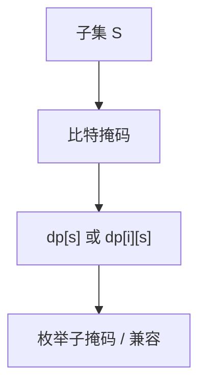
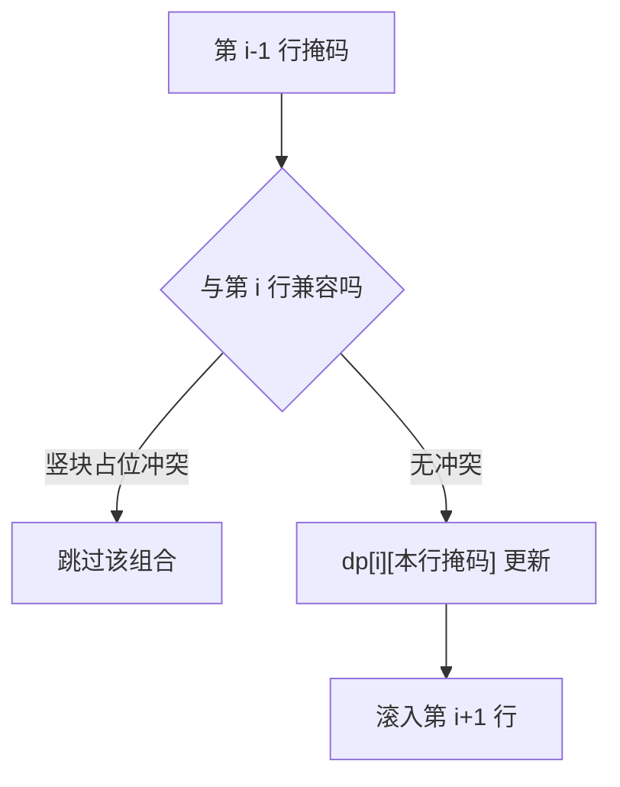

# 状态压缩 DP

子集或网格一行用比特掩码当状态下标；$2^n$ 个子集上转移，常 $O(3^n)$ 或 $O(2^n\mathrm{poly})$。

<footer>—— 据 Held and Karp, 1962 的子集 DP；CLRS 第 15 章整理</footer>

上一课[概率与期望 DP](/cs/probability-dp)把状态方程写在一般 $s$ 上。主干[动态规划](/cs/dynamic-programming)已给最优子结构。缺口是 $s\subseteq\{1..n\}$ 用整数掩码。哈密顿课的 Held–Karp 已是实例；本课把状压收成技法：旅行商、子集和、棋盘铺砖一行。不重写期望方程。后课树形 DP 换树。

## 问题

$n\le 20$ 时 $2^n$ 可存。转移：枚举子集、子集的子集（$O(3^n)$：对每位 0/不选/选在子集）、或按位 SOS DP（$O(n2^n)$）点名。铺砖：第 $i$ 行掩码与第 $i-1$ 行兼容则转移。

数字实例：$n=20$ 时 $2^{20}\approx 10^6$ 个状态，每个存一个 4 字节整数约 4 MB，一台手机都装得下；$n=40$ 则是 $2^{40}\approx 10^{12}$ 个状态，几个 TB 起——状压的生死线就在这几十倍 $n$ 上。

缺口是掩码，不是再证 NPC。精确 TSP 已讲，本课强调通用接口。

### 不是把 $n=40$ 硬压

$2^{40}$ 内存爆炸。要折半、meet-in-the-middle 或换算法。不要「状压万能」。

Held–Karp 子集。SOS DP 是高维前缀。后课插头 DP 是网格边界轮廓，比一行掩码更细。

## 方法

编码占用/奇偶/颜色到比特。预处理合法掩码列表。转移循环 `for s` `for t subset s` 或滚动数组两行。

```mermaid
flowchart TD
  SET["子集 S"] --> MASK["比特掩码"]
  MASK --> DP["dp[s] 或 dp[i][s]"]
  DP --> TR["枚举子掩码 / 兼容"]
```

术语翻译：掩码（mask）就是一个二进制数，第 $i$ 位是 1 表示「第 $i$ 个元素在集合里」。比如集合 {0, 2} 写成二进制 101，也就是整数 5——于是「集合」变成了能当下标的普通整数，放进数组就是 `dp[5]`。

位运算 `__builtin_ctz` 枚举。

## 机制

状态空间指数但 $n$ 小则多项式于 $2^n$。与生成函数：子集卷积可用 Walsh/NTT，本课朴素 $3^n$ 先会。与线性基：都是比特，一个优化一个 DP。

铺砖的一行内转移长什么样，值得单独画：第 $i$ 行的轮廓决定第 $i+1$ 行哪些掩码合法。

```mermaid
flowchart TD
  PREV["第 i-1 行掩码"] --> COMP{"与第 i 行兼容吗"}
  COMP -->|"竖块占位冲突"| SKIP["跳过该组合"]
  COMP -->|"无冲突"| CUR["dp[i][本行掩码] 更新"]
  CUR --> NEXT["滚入第 i+1 行"]
```

「枚举子集的子集是 $O(3^n)$」可以这么直觉化：把三元组（全集、子集 $S$、$S$ 的子集 $T$）摊到每个元素头上，每个元素只有三种角色——不在 $S$、在 $S$ 但不在 $T$、在 $T$。三种选择相乘就是 $3^n$，而不是先数子集再数子集的 $4^n$。

## 边界

本课不写全部 SOS 恒等式。不写量子。后课默认：$n\le 20$ 子集问题优先状压。下一课树形 DP。

## 小结

- 掩码下标 = 子集；转移枚举子掩码或兼容行。
- $O(3^n)$、$O(n2^n)$ 是常见界。
- $n$ 稍大即不可用。
- 出处：Held and Karp, 1962；CLRS 第 15 章。
