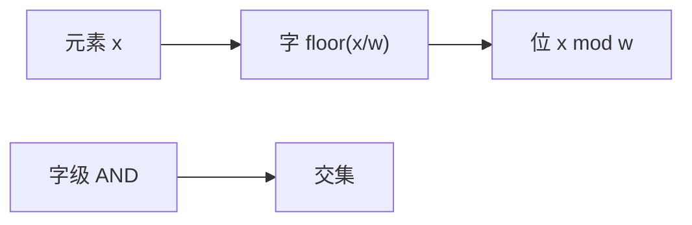

# 位图与位集

论域是一小段整数时，存在位里：交并差是字级与或非，比指针集合少两个数量级的常数。

<footer>—— 据 Knuth, The Art of Computer Programming 卷 4A；Cormen, Leiserson, Rivest and Stein 整理</footer>

[上一课](/cs/mo-algorithm)用计数或哈希维护区间状态，每个元素仍是一条「在/不在」记录。论域若是 $[0,U)$ 且 $U$ 不太大，不必哈希。[数组](/cs/array-random-access)按字寻址。本课不重排询问。缺口是位图 / bitset：用 $\lceil U/w\rceil$ 个机器字表示子集，$w$ 为字宽，交并扫描字。

## 问题

集合操作在链表或哈希表上按 $n$ 走。位图：第 $x$ 位表示 $x$ 是否在集合中，查找/插入/删除 $\Theta(1)$ 字操作（移位与掩码）。并、交、差：对每个字 `or`/`and`/`and-not`，时间 $\Theta(U/w)$。缺口不是新的集合公理，而是**把存在性压进位、把循环交给字级并行**。

稀疏时 $U\gg n$，位图浪费空间——下一课稀疏集合。本课假定 $U$ 与 $n$ 同阶或 $U$ 固定（字符集、小值域）。

Knuth 卷 4A 对位技巧与人口计数有系统处理。硬件 `popcount` 让「集合大小」也变成按字。

## 方法

下标 $x$ 的字号 $\lfloor x/w\rfloor$，位 $x\bmod w$。迭代「下一个 1」可用 `ctz`（尾零计数）扫字。区间置位可用字填充加两端掩码，不必循环 $r-l$ 次比特。

与[布隆过滤器](/cs/bloom-filter)：Bloom 允许假阳性且不存论域下标；位图精确，论域必须能映射到 $0..U-1$。

## 机制

cache：连续字扫交并，带宽决定时间，符合[局部性](/cs/locality-principle)。图的邻接矩阵行是位图时，相交计数是矩阵乘法的位版，本课只点名。不要用位图表示任意字符串键——先要整数化。

可持久化位图可做路径复制或只读共享页，那是后课持久化结构，本课原地更新。

## 边界

$U$ 过大不可分配。并发改同一字要原子位运算，课序后段再谈。本课不把 SIMD 全套指令当正文。值域大、元素少：稀疏集合用紧数组 + 稠密下标。

后课默认：小论域精确集用位图。稀疏整数集用 sparse set。

## 小结

- bitset：精确、字级交并，时间 $\Theta(U/w)$。
- 论域要小或固定；稀疏换下一课。
- 出处：Knuth, TAOCP 卷 4A；Cormen et al.。
