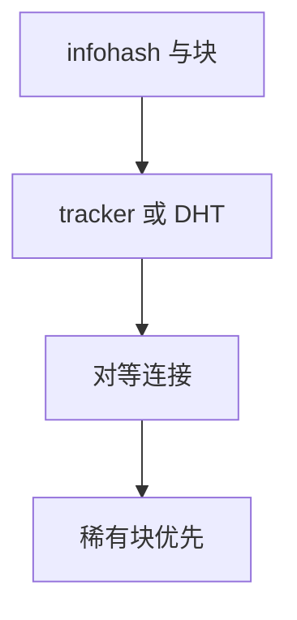

# BitTorrent 与 DHT

文件切成块，对等方互传；tracker 或 DHT 负责发现邻居。稀有块优先，使复制在群体里展开，而不是一台源打满 $C$。

<footer>—— 据 Cohen, The BitTorrent Protocol；RFC 9529 等 DHT 实践；Kademlia 对照整理</footer>

[FTP](/cs/ftp-passive) 是中心源。[上一课](/cs/ftp-passive) 结束该课序。缺口是 **P2P 分发**：swarm、片、DHT。本课不把 WebRTC 写完。

## 问题

热门文件把 HTTP 源与 CDN 账单打满。BitTorrent：元数据列块哈希，对等互传，稀缺优先，tit-for-tat 激励上传。Tracker 集中列表；DHT（Kademlia 风格）用 infohash 找 peers，无单点。NAT 仍痛，要打洞或中继。不是多播树，是应用层覆盖。

不要把 DHT 写成 DNS。

Cohen 规范。BEP 文档。本课不写盗版场景。

### 应用层 mesh

块哈希防污染；DHT 去中心发现。不是 DNS，也不是 IP 多播树。NAT 与激励是部署约束。

## 方法

画：种子 → 块 → 邻居集合。对照 CDN：CDN 有树与缓存层次，BT 有 mesh。与 ECMP 无关直接。

方法止于选定对象与对照；机制才说它如何嵌入已有分层与主干课。

## 机制

传输仍是 TCP（或 μTP），拥塞各连接 AIMD，共享接入会互抢——接入 AQM 有帮助。DNS 可找 tracker。加密扩展点名。GeoDNS 不调度块。

安全：污染块靠哈希；DHT 污染是另一攻击面，点名不展开。

## 边界

本课不引入 BitTorrent v2 的全部。WebRTC 与 ICE 是下一课。后课默认：P2P 分发 = 块交换 + 发现；DHT 去中心发现。

企业网禁 P2P 端口是政策，不是协议缺陷。

上一课留下的缺口在本课收口；「BitTorrent 与 DHT」进入后课词汇表后只引用。文献用来钉对象与边界，不把本课写成该主题的独立综述。下一课[WebRTC 与 ICE](/cs/webrtc-ice)。

## 小结

- 块交换摊源；稀有优先。
- Tracker 或 DHT 发现邻居。
- 覆盖网在应用层，NAT 是障碍。
- 后课只引用本课钉死的对象，不从该领域总问题重开。
- 出处：Cohen；Kademlia/DHT 实践。
