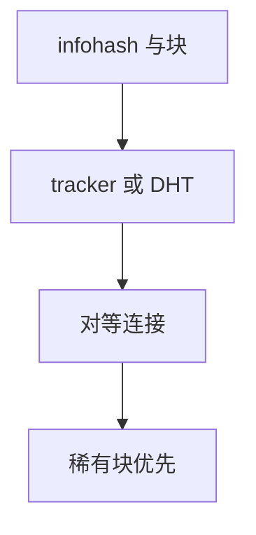
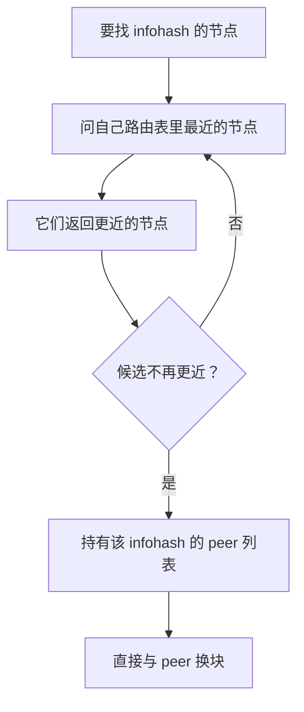

# BitTorrent 与 DHT

文件切成块，对等方互传；tracker 或 DHT 负责发现邻居。稀有块优先，使复制在群体里展开，而不是一台源打满 $C$。

<footer>—— 据 Cohen, The BitTorrent Protocol；BEP 5 等 DHT 实践；Kademlia 对照整理</footer>

[FTP](/cs/ftp-passive) 是中心源。[上一课](/cs/ftp-passive) 结束该课序。缺口是 **P2P 分发**：swarm、片、DHT。本课不把 WebRTC 写完。

## 问题

热门文件把 HTTP 源与 CDN 账单打满。BitTorrent：元数据列块哈希，对等互传，稀缺优先，tit-for-tat 激励上传。Tracker 集中列表；DHT（Kademlia 风格）用 infohash 找 peers，无单点。NAT 仍痛，要打洞或中继。不是多播树，是应用层覆盖。

不要把 DHT 写成 DNS。

常见误区：把 DHT 想成「去中心化的 DNS」。DNS 是分层授权的树，根区与顶级域由机构管；DHT 没有根，一个键归谁管由哈希距离决定，节点进出只挪动一小段键的负责权。两者的「查询名字找东西」只是表象相似。

Cohen 规范。BEP 文档。本课不写盗版场景。

### 应用层 mesh

块哈希防污染；DHT 去中心发现。不是 DNS，也不是 IP 多播树。NAT 与激励是部署约束。

## 方法

画：种子 → 块 → 邻居集合。对照 CDN：CDN 有树与缓存层次，BT 有 mesh。与 ECMP 无关直接。

```mermaid
flowchart TD
  META["infohash 与块"] --> DISC["tracker 或 DHT"]
  DISC --> PEER["对等连接"]
  PEER --> RARE["稀有块优先"]
```

「稀有块优先」可以类比成物种保护：最濒危的块一旦随个别节点退出而灭绝，整个 swarm 就永远凑不齐文件。先传最少的副本，等于把遗传多样性铺开——这是 P2P 自愈能力的来源，不是道德，是算术。

## 机制

传输仍是 TCP（或 μTP），拥塞各连接 AIMD，共享接入会互抢——接入 AQM 有帮助。DNS 可找 tracker。加密扩展点名。GeoDNS 不调度块。

安全：污染块靠哈希；DHT 污染是另一攻击面，点名不展开。

DHT 在没有 tracker 时如何找到 peers，值得单独画一条查找链。

```mermaid
flowchart TD
  Q["要找 infohash 的节点"] --> N1["问自己路由表里最近的节点"]
  N1 --> N2["它们返回更近的节点"]
  N2 --> CONV{"候选不再更近？"}
  CONV -->|"否"| N1
  CONV -->|"是"| PEERS["持有该 infohash 的 peer 列表"]
  PEERS -->Conn["直接与 peer 换块"]
```

术语翻译：DHT（分布式哈希表）就是把键值对摊到所有参与者手里，每个节点负责键空间的一小段；查询不问中心，而是一跳一跳问「谁离这个键的哈希更近」。Kademlia 用 160 位异或距离度量，路由表按距离分桶存 $k$（约 8 到 20）个节点，查找通常对数跳收敛。

## 边界

本课不引入 BitTorrent v2 的全部。WebRTC 与 ICE 是下一课。后课默认：P2P 分发 = 块交换 + 发现；DHT 去中心发现。

企业网禁 P2P 端口是政策，不是协议缺陷。

下一课[WebRTC 与 ICE](/cs/webrtc-ice)。

## 小结

- 块交换摊源；稀有优先。
- Tracker 或 DHT 发现邻居。
- 覆盖网在应用层，NAT 是障碍。
- 后课只引用本课钉死的对象，不从该领域总问题重开。
- 出处：Cohen；Kademlia/DHT 实践。
