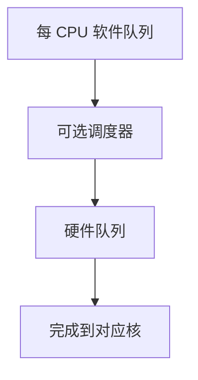

# blk-mq

多队列块层让每个 CPU、每个硬件队列各有提交路径，避免一把大锁串行化所有请求。

<footer>—— 据 Axboe 对 Linux 多队列块层的设计；Silberschatz 对 I/O 子系统的整理</footer>

[上一课](/cs/disk-sched)在单队列上讲 SCAN/LOOK。NVMe 与多核上，全局电梯自己成为瓶颈：锁与缓存行争用超过寻道。[writeback](/cs/writeback) 会从各 CPU 同时提交。缺口是 **blk-mq**：软件队列对硬件队列，调度下沉到每队列或设备侧。

## 问题

经典 request_queue 一把锁保护电梯。SSD 没有磁头，FCFS 或简单合并更合适，但锁仍序列化。缺口：每 CPU 一个 software staging queue，映射到设备的多条 hardware queue；完成中断可绑在对应核。合并与超时仍在，只是范围变成每队列。本课不把 mq-deadline/kyber/none 的参数表背完。

none 调度器几乎只做合并与派发，适合 NVMe。机械盘仍可用单硬件队列加上 deadline，教学上承认「电梯不是消失，是可选插件」。

## 方法

FS/VFS 提交的请求进入本 CPU 的软件队列，可选插入 I/O 调度器，再映射到硬件队列门铃。完成：IRQ → 下半部在对应核清请求、结束 bio。与 [中断下半部](/cs/interrupt-bottom-half) 已有路径对接。不要在此重写 DMA；下一课 bio 才是请求的内存形状。

## 机制

blk-mq 把块层从「一个电梯」改成「可扩展提交」：多道写回不再挤在同一把锁上。磁盘调度课的公平与饥饿问题仍可能在单队列插件里出现；多队列上公平变成每核/每 cgroup 的配额，隔离课再谈。本课只钉队列拓扑。

与网络栈的多队列网卡类似，但对象仍是块请求，不是帧。

## 边界

本课不引入 io_uring 与 blk-mq 的对接全文（后课 io_uring）。不保证所有设备暴露多硬件队列。下一课：一条请求如何描述「这些页、这些扇区」——bio。

后课默认：提交可并行进多队列。分散聚集的请求对象是 bio。

## 小结

- blk-mq 用每 CPU/每硬件队列去掉全局电梯锁。
- 调度器变成可选插件；NVMe 常用 none。
- 请求的页与扇区描述是 bio 的缺口。
- 出处：Axboe, Linux blk-mq；Silberschatz et al., *OSC*；Love, *LKD*。
