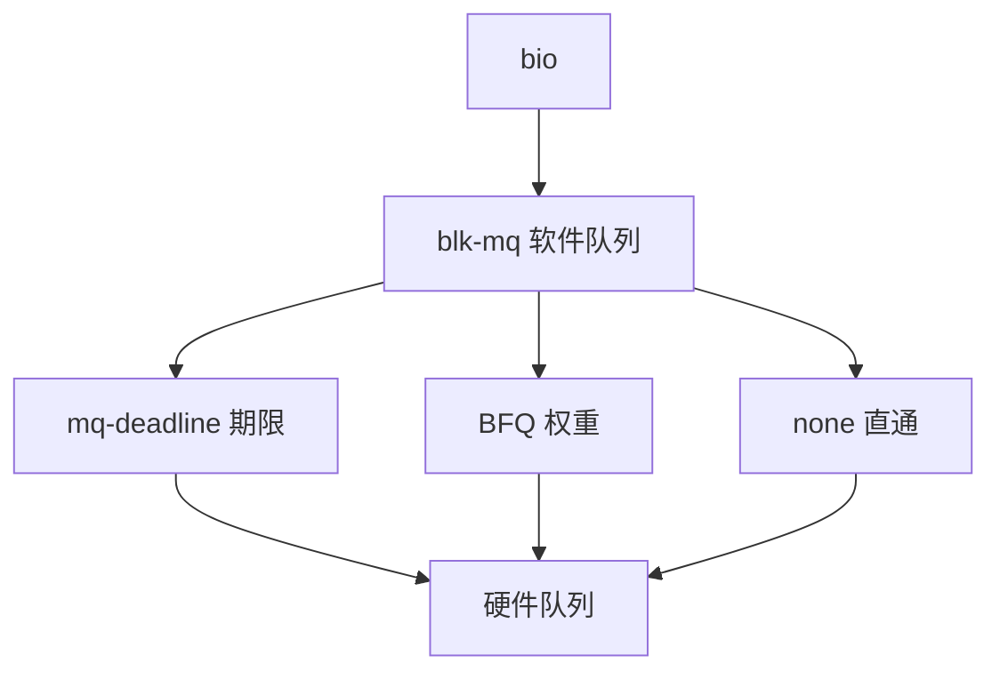

# mq-deadline 与 BFQ

块层调度器把已提交的 bio 重新排序或分时：deadline 防饥饿，BFQ 按权重摊带宽，多队列时代默认常常是 none 或 mq-deadline。

<footer>—— 据 Axboe 对 Linux 块层的设计；Valente 等对 BFQ 的论述；McKusick 对磁盘臂调度的背景</footer>

[上一课](/cs/sendfile-splice)把页送进 I/O 路径。请求还要变成对设备的队列。[磁盘调度](/cs/disk-sched) 主干给过电梯直觉。缺口是 **Linux 多队列调度器**：blk-mq 上的 mq-deadline 与 BFQ，以及为何 NVMe 上常关掉调度。

## 问题

HDD 上随机写很贵，CFQ/BFQ 把进程带宽当公平对象。NVMe 多队列、延迟以十微秒计，软件再排序可能净亏损。mq-deadline：读写分开 FIFO，给读一个期限以免被写饿死。BFQ：按 cgroup/进程权重分配时间片，适合桌面与共享 HDD。none：硬件队列即调度。缺口不是再讲柱面，而是：请求在 blk-mq 软件队列与硬件队列之间如何被选走。

单队列时代的 CFQ 已退。kyber 是延迟目标另一选择。本课以 deadline 与 BFQ 对照「期限 vs 公平」。

## 方法

FS 提交 bio → 请求 → 某 hctx 的调度器。mq-deadline 维护读/写 FIFO 与按扇区排序树，到期则派读。BFQ 维护每队列 vtime，选最小者，空闲时 idling 等待同步。完成 IRQ 后可再派下一个。对照 [预读](/cs/readahead)：大顺序请求让任何调度器都轻松。对照 [O_DIRECT](/cs/direct-io)：请求尺寸由应用决定。

## 机制

调度器把「谁先用设备」从 FS 里抽出来，使同一块设备可被公平或低延迟策略分享。闪存上这条税常不值得，于是默认 none。不要把 BFQ 写成 CFS：对象是请求与带宽，不是 CPU vruntime，虽然公平份额直觉同源。

与 [cgroup](/cs/cgroups)：blkio/io 控制器给 BFQ 权重或限制 IOPS，后课 blkio 再钉。

实现上：blk-mq 的软件队列按 hctx 分，调度器状态也是每队列一份，不再有全局电梯锁。NVMe 默认 none 后，io.weight 一类公平只能靠 BFQ 或 cgroup 节流，而不是硬件自己懂权重。 读法上只引用[上一课](/cs/sendfile-splice)的结论，不把对象换成训练推理或限价簿。

本课在操作系统进阶的「存储栈 / 块层到设备」课序里，对象是 **mq-deadline 与 BFQ**。

- 先修只引用，不重导：上一课的结论当公理，本课只补差。
- 五栏不吞并：不把本课写成大模型训练/推理，也不写成限价簿或权重量化。
- 文献用 OSTEP、McKusick、内核文档与具名会议论文；不发明 arXiv 编号。

## 边界

本课不引入每个调参 sysfs 文件。不保证 virtio-blk 上的最佳选择。下一课看设备端真正的多队列：NVMe 驱动。

版本字段会变，课序钉的是机制对象「mq-deadline 与 BFQ」，不是某一主线内核的结构体名。
后课默认：块层可以排序或直通。NVMe 提交/完成队列如何接驱动，下一课。

## 小结

- mq-deadline 用期限防读饥饿；BFQ 摊带宽；NVMe 常 none。
- blk-mq 把请求送到每核硬件队列。
- NVMe 驱动是下一课。
- 出处：Linux 块层文档；Valente BFQ；Axboe；*OSTEP*。
