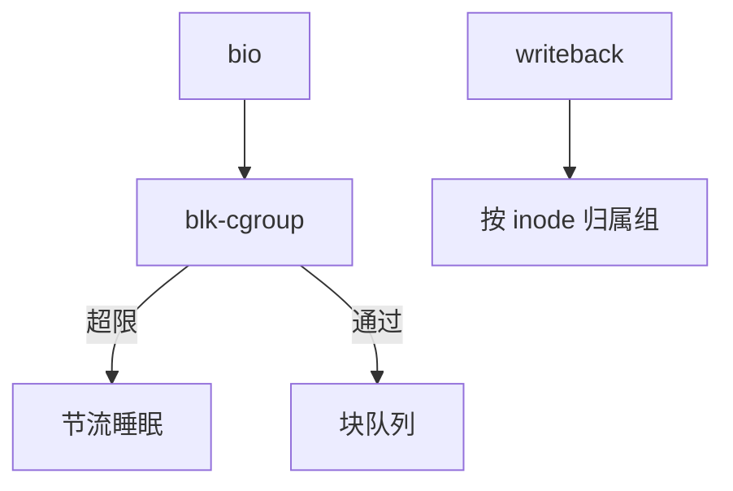

# blkio cgroup

blkio（io 控制器）给 cgroup 挂上每设备的权重、bps、iops 上限，使容器不能把共享盘打满。

<footer>—— 据 Linux cgroup v2 io 文档；内核 blk-cgroup 说明</footer>

[上一课](/cs/io-polling)把设备用到满带宽。[cgroups](/cs/cgroups) 主干有组；[BFQ](/cs/blk-schedulers) 能看权重。缺口是 **io 控制器**：统计与限制如何接到 bio，以及 v1 blkio 与 v2 io 的差别点到为止。

## 问题

多租户共享一块 NVMe，一个容器 `dd` 会抬高所有人的延迟。io.max：bps/iops 上限；io.weight：在支持的调度器上相对份额。缺口：限制发生在 blk-cgroup 节流，可能睡眠提交者；递归统计；缓冲 I/O 的归属按谁脏页——异步写回可能记到根组，这是著名坑。本课不把 cpu 控制器再讲一遍。

writeback 归属（cgroup writeback）要把 inode 与 memcg/io 关联，否则限制被绕过。教学上承认「脏页回写的会计」是机制一部分。

## 方法

提交 bio 时：查任务的 css，若超过 iops 则 `blk_throtl` 延迟。完成时加统计。对照 [配额](/cs/fs-quota)：配额是 FS 持久占用；blkio 是即时带宽。对照 [thin](/cs/thin-provisioning)：池满是容量，不是 iops。对照 NVMe：限制在软件，设备仍看见合并后的请求。

## 机制

blkio 把设备当成可计量的共享资源，使「容器隔离」在 I/O 维可执行。它不加密、不冗余。不要写成云产品 QoS 页面。与轮询：被节流的线程 poll 也会空转，策略要一起设计。

v2 统一 io 控制器；旧 blkio 文件名不同，对象相同。

实现上：异步回写若记到 root，容器上限等于没设。cgroup writeback 用 inode 归属把脏页会计拉回组。iops 限制对 NVMe 很有效，对 HDD 可能只是把队列变短。 读法上只引用[上一课](/cs/io-polling)的结论，不把对象换成训练推理或限价簿。

本课在操作系统进阶的「存储栈 / 块层到设备」课序里，对象是 **blkio cgroup**。

- 先修只引用，不重导：上一课的结论当公理，本课只补差。
- 五栏不吞并：不把本课写成大模型训练/推理，也不写成限价簿或权重量化。
- 文献用 OSTEP、McKusick、内核文档与具名会议论文；不发明 arXiv 编号。

## 边界

本课不引入所有 `io.latency`/`io.cost` 模型细节。不保证网络块设备（iSCSI）上的统计准到应用级。下一课请求里的「必须到介质」标志：写屏障与 FUA。

版本字段会变，课序钉的是机制对象「blkio cgroup」，不是某一主线内核的结构体名。
后课默认：cgroup 可节流块 I/O。如何要求设备掉电不丢这一笔，下一课屏障/FUA。

## 小结

- io 控制器限制权重与上限；writeback 归属是关键。
- 与 FS 配额、精简池满不是同一层。
- 写屏障与 FUA 是下一课。
- 出处：cgroup v2 io；Linux blk-cgroup；Love 对 cgroup 的背景。
