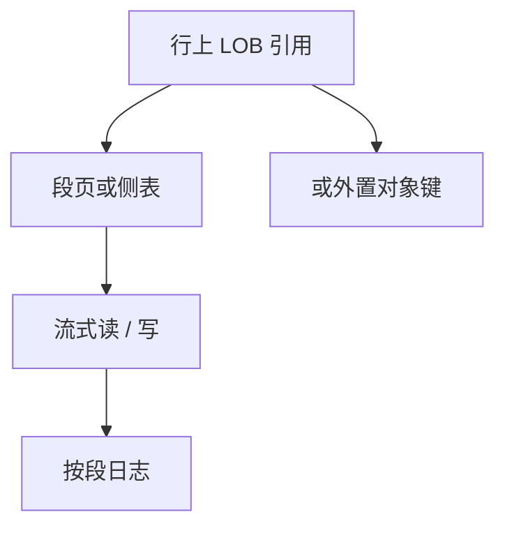

# 大对象存储

大对象不进普通行槽：流式读写、单独 WAL 策略、可选外置文件，避免一次把缓冲池打成一张图片。

<footer>—— 据 SQL BLOB/CLOB；Stonebraker 等对大对象；Ramakrishnan and Gehrke</footer>

[上一课](/cs/varlen-overflow)把中等变长放进溢出链。本课不跟转发 RID。缺口是 MB–GB 级值：若当超长 VARCHAR，VACUUM、复制、统计、一次 `SELECT *` 都会灾难。大对象（LOB）是另一存储主键：oid 在行上，字节在侧表或文件系统，API 是分段读写。

## 问题

事务：LOB 写入要原子可见，崩溃要回滚未提交字节。若外置文件不进 WAL，就要另做强制与垃圾回收。缺口是**与行同一 ACID 还是最终一致外链**。应用把图片 URL 放进对象存储、库内只留键，是常见切分——那是应用设计，库仍可能提供内置 LOB。

复制：物理复制会把 LOB 页也传；逻辑复制可能跳过或切片。CDC 后课。查询优化：不要把 LOB 列拖进哈希表当连接键。

SQL 标准 BLOB/CLOB。PostgreSQL large object 与 TOAST 阈值分工。本课不把对象存储网关当数据库内核必做，但点名外置是合法边界。

## 方法

行内存 LOB 定位符。读：`read(offset, len)` 填缓冲，不一次性物化。写：追加或覆盖段，日志按段。GC：删除行后回收 LOB 页，与 MVCC 可见性对齐——未结束快照仍可能读旧字节。

索引：通常不直接索全文，可对校验或元数据列索引；全文倒排对 CLOB 要分词管道。

## 机制

缓冲池：LOB 段用一次性访问模式，替换应像扫描。pin 泄漏一张 1GB 对象会冻死池。压缩：段级压缩，随机偏移要可寻址或放弃跨段解压。

安全：权限在行级还是 LOB oid 级，漏洞常出在「知道 oid 就能读」。行级安全后课。

## 边界

本课不讲表分区键如何包含 LOB。也不把向量嵌入当 BLOB 教程——向量库后课有自己的 ANN 文件。透明加密可盖 LOB 段。

后课默认：大值走 LOB 或外置，行上只留引用。表分区：水平切行集合，控制扫描与维护窗口。

一次 `SELECT *` 拉出所有 LOB 是接口设计错误，不是优化器无能。

## 小结

- LOB 流式分段，行上存引用；WAL/GC 必须覆盖段。
- 外置对象存储把一致性边界外移。
- 表分区下一课：按键水平切表。
- 出处：SQL LOB；Ramakrishnan and Gehrke；TOAST/large object 实践。
