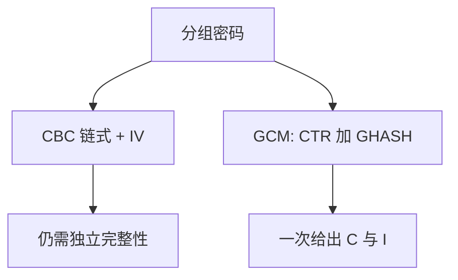

# 分组模式 CBC / GCM

分组密码只加密定长块；CBC 用链式 IV 扩到消息，GCM 再把保密与完整性收成一次 AEAD。

<footer>—— 据 NIST 对 CBC 与 GCM；Stallings；Anderson 对「只加密不够」的整理</footer>

[上一课](/cs/symmetric-crypto)给出共享密钥下的语义安全直觉。本课不重定义「不可区分」。缺口是工作模式：ECB 泄露相等块；CBC 需要不可预测 IV；仅加密不防篡改。[Dolev–Yao](/cs/dolev-yao) 的理想锁在真实模式选错时并不成立。公钥信封下一课。

## 问题

对称课留下「工作模式」。消息长度不是一块。CBC：IV 异或后链式，解密可并行。缺完整性时，密文被改可能变成对明文的可控差异——本课只陈述性质与防御：必须另加 MAC 或改用 AEAD。GCM：CTR 保密 + GHASH 认证，IV 不得复用。缺口是**模式如何兑现 C 与 I**。

IV/nonce 复用是规格失败，不是「算法过时」。防御是随机 IV、唯一 nonce、或协议层禁止重用。不给构造步骤。

## 方法

只保密：CBC + 独立 MAC（Encrypt-then-MAC）是经典组合。优先 AEAD（GCM 等）：一次密钥、一次 nonce、密文带认证标签。TLS 1.3 只保留 AEAD 套件（后课 RFC 8446）。本课不比较全部厂商模式缩写。

## 机制

模式把块函数变成消息函数。完整性失败会让 DY 敌手「改项仍被当成合法密文」，理想锁破产。IV 是状态，不是密钥，但必须按模式合同使用。后课公钥只运这把对称键，大数据仍走本课 AEAD。

## 边界

本课不引入填充预言的操作细节，不把任何利用链写成可复现步骤。第一次见面如何分发密钥，下一课公钥与信封。

后课默认：长消息用 AEAD。密钥分发用公钥封装。

## 小结

- CBC 扩块；单独加密不给完整性。
- GCM 一类 AEAD 同时服务 C 与 I。
- 公钥信封下一课。
- 出处：NIST 模式；Stallings；Anderson。
