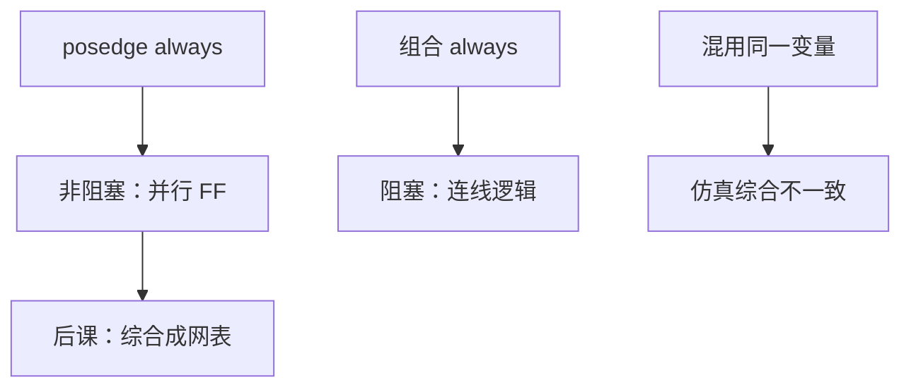

# 阻塞与非阻塞赋值

  
同一 always 里，`=` 立刻改左值，`<=` 采样右值、在时间步结束再更新；混用会让仿真看到的移位寄存器变成软件式覆盖。

  <footer>—— 据 Cummings, Nonblocking Assignments in Verilog Synthesis, Coding Styles That Kill, SNUG 2000；IEEE Std 1364；Harris and Harris, Digital Design and Computer Architecture 整理</footer>

[上一课](/cs/verilog-basics)钉了模块与 `always`，并把「仿真是否等于硬件」留作缺口。组成课的[触发器](/cs/flipflop-types)是并行采样的。缺口是赋值运算符：**阻塞 `=` 与非阻塞 `<=`** 如何对应组合与边沿寄存器。

## 问题

移位寄存器：三个 FF 应同时用旧值。若在 `posedge clk` 里写 `a=b; b=c;`，仿真变成串行覆盖，综合仍可能推出三只 FF——**仿真/综合不一致**。正确风格：时序块用 `<=`，组合块用 `=`。缺口不是新的触发器电路，而是语言调度：NBA（nonblocking assignment）在当前活跃事件之后更新。

Cummings 的规则是工业常识：不要在同一 `always` 里对同一变量混用两种赋值。

### 非阻塞不是「异步、不必等时钟」

`<=` 仍然只在该 `always` 被触发时求值（通常是 `posedge`）。它不表示跨时钟域，也不表示组合旁路。把 nonblocking 理解成软件 async，CDC 课会对不齐。

Clifford Cummings, SNUG 2000 是本课主文献。IEEE 1364 规定事件队列。Harris 用移位寄存器当反例。

## 方法

`always @(posedge clk)`：全部 `<=`，读到的是本拍开始的寄存器值，对应并行 FF。`always @(*)`：`=` 描述组合函数，避免意外锁存（每个输出在所有分支赋值）。临时组合量在时序块里可用阻塞算出中间值再 NBA 给寄存器——要极克制，本课推荐中间量拉到组合块。

`#delay` 只为仿真，综合忽略。后课网表不再有这两种赋值，只剩门延迟。

## 机制

综合器把 NBA 到 `reg` 映射为触发器，把组合 `=` 映射为门。错误风格可能推断出锁存（level-sensitive），与边沿规格不符，[建立保持](/cs/setup-hold)窗口会换一套。本课把风格钉死，让后课 STA 分析的是预期的 FF+组合。

## 边界

本课不讲 SystemVerilog 的 `always_ff`/`always_comb` 全部语义差异（它们有助于工具检查，推荐用，但不替代对 NBA 的理解）。不引入 PLI。不把 Python 协程类比过来。

后课默认：时序非阻塞、组合阻塞；移位与流水线按并行采样理解。

## 小结

- `<=` 对应并行触发器采样；`=` 对应组合立刻传播。
- 混用制造仿真/综合裂缝。
- 下一课：这些块如何变成门级网表。
- 出处：Cummings, SNUG 2000；IEEE 1364；Harris and Harris。
