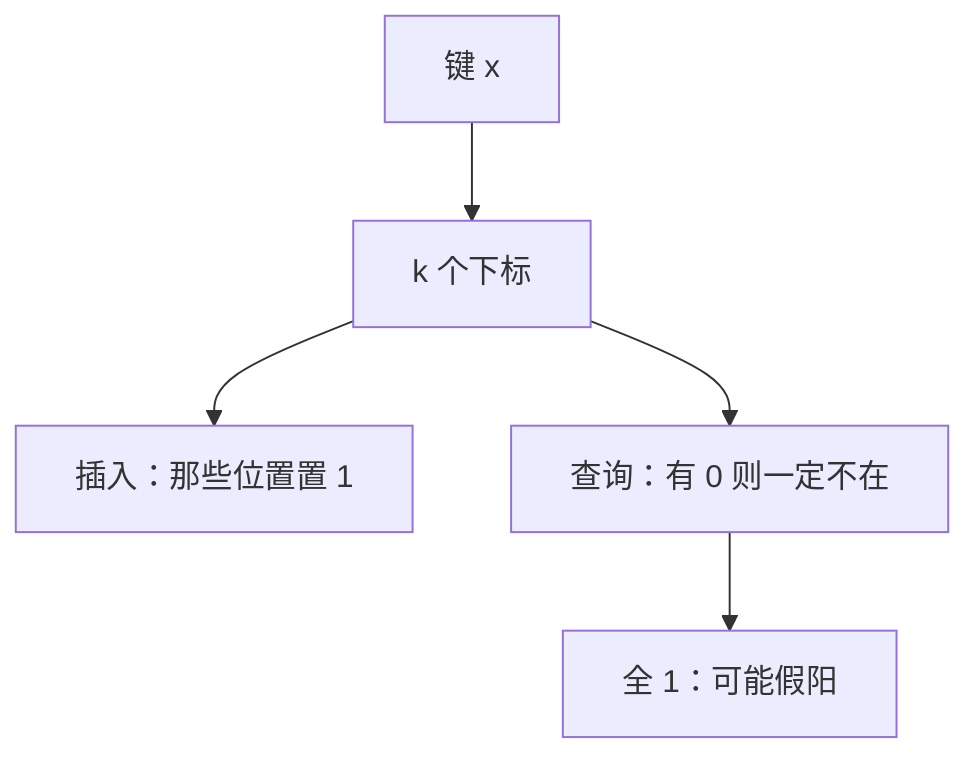

# 布隆过滤器

只问「可能在集合里吗」，允许把真正在的说成在、把不在的偶尔说成在；换来的是远小于存全体键的那一块位图。

<footer>—— 据 Bloom, Space/Time Trade-offs in Hash Coding with Allowable Errors, CACM 1970 整理</footer>

[上一课](/cs/robin-cuckoo)仍是精确字典：查到就是在，碰不到就是不在。[散列函数](/cs/hash-function)给出 $h(k)$。本课不重讲探测序列。缺口是近似集：Bloom 用 $m$ 位数组和 $k$ 个散列，插入置位，查询若有一位为 0 则**一定不在**，全为 1 则**可能在**（假阳性）。跳表下一课回到精确有序结构；本课不保序、不存键。

## 问题

缓存、路由、数据库里经常先问「这个键有没有可能命中后面那份昂贵结构」。存完整散列集会太大。缺口不是再开一张布谷表，而是**允许单侧错误**：假阳性可接受，假阴性不可（标准 Bloom 无删除则不会假阴）。空间约 $m$ 比特，与 $n$ 和目标误差 $\varepsilon$ 有关，远小于存键。

删除：清位会误伤其他键。标准结构不支持删；计数 Bloom 是附录。

Bloom 1970 原文就是「允许错误的散列编码」。$k$ 个独立均匀散列是分析假设；实践用两个散列派生多个下标。

## 方法

`insert(x)`：对 $i=1..k$ 置 `B[h_i(x)]=1`。`query(x)`：若某 `h_i(x)` 为 0 则否；否则报「可能」。假阳性率约 $(1-e^{-kn/m})^k$，给定 $m,n$ 可挑 $k$ 使误差近最小（约 $k=(m/n)\ln 2$）。本课不把求导写进主干，只钉误差随 $m/n$ 与 $k$ 降。

与精确表串联：布隆说不在则跳过；说可能再查真字典。假阳只浪费一次精确查找。

## 机制

不存键，故不能迭代集合、不能返回卫星数据。这与字典合同不同，跳课的人若当 hashset 用会丢数据。局部性：一次查询碰 $k$ 个可能分散的位，cache 行为不如线性探测；$m$ 若适合放进 SRAM 则仍快。

再散列或扩容位图要重建，不能像动态数组那样只复制旧位——散列下标依赖 $m$。

## 边界

本课不引入 cuckoo filter 的指纹、不把密码学哈希当必须。也不进入大模型词表或量化栏的「权重量化」——那是另一栏。安全栏的哈希抗碰撞与这里的均匀位图不是同一需求。

后课默认：只需过滤的否定查询用布隆。要精确有序字典且不想旋转，下一课跳表用随机层高。

## 小结

- 布隆：位图 + 多散列；无假阴（无删时），有假阳。
- 不存键，不是字典；误差由 $m,n,k$ 管。
- 精确有序的期望对数结构是下一课跳表。
- 出处：Bloom, *CACM*, 1970。
