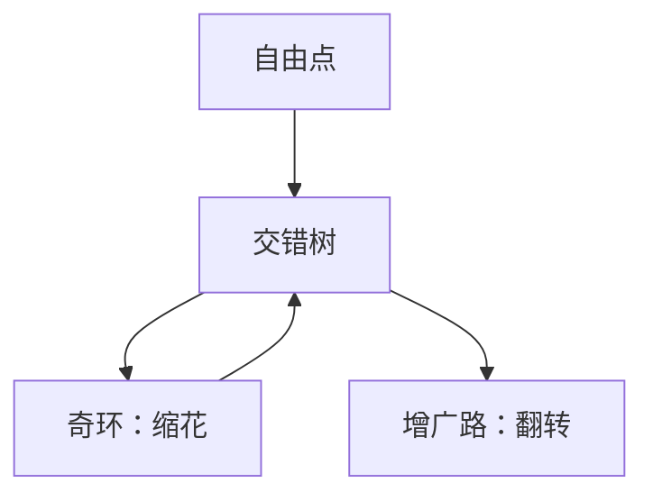

# Edmonds 带花树

非二分图的增广路上可能长出奇环（花）；把花缩成点继续搜，展开后仍是交错增广。

<footer>—— 据 Edmonds, Paths, Trees, and Flowers, 1965；CLRS 与标准匹配教材整理</footer>

上一课[KM 与最大权匹配](/cs/hungarian-km)停在二分。主干匹配课已警告：奇环上「随便交错」会坏。缺口是一般图最大基数匹配：Edmonds 的花（blossom）。不重写二分 HK。后课稳定婚姻换偏好，不是基数匹配。

## 问题

Berge：匹配最大 $\Leftrightarrow$ 无增广路，一般图也成立。搜索从自由点长交错树时，若一条非树边连到树上的偶点（相对根的交错距离），则得到奇环：花。把花缩成超点，在收缩图上继续。找到增广则沿花展开还原路径。无增广则当前匹配最大。

缺口是收缩，不是否定 Berge。朴素实现多项式但常数大；$O(VE)$ 量级可接受；更快的 MV 算法不在本课展开。

### 花不是随便一个奇环

花必须是交错树里由基点（花的 LCA 式基）长出的交错奇环。图里随便一个三角形不必立刻缩。收缩保持「有增广 $\Leftrightarrow$ 原图有增广」的对应。

Edmonds 1965 证明一般图匹配在 P。Gabow、Lawler 给出实现整理。带权一般匹配要带权花，本课只基数。后课 Gale–Shapley 是偏好稳定性，可非二分但问题不同。

## 方法

从自由点 BFS/DFS 长交错树。分类邻边：未访则长树；碰到偶点则缩花；碰到另一棵树的自由点则增广。缩花用并查集维护超点。展开按花的奇偶走基点两侧之一。

正确性依赖收缩引理，本课认结论：多项式可求最大匹配。

## 机制

奇环上从基点出发两条交错路长度奇偶不同，收缩后把「绕环」变成超点上的普通边，避免搜索在环上死转。二分图无奇环，花不出现，算法退化为匈牙利。与最大流：一般图匹配没有简单的单位二分网络（除非允许指数顶点）。

不要用「染色看二分」代替花：非二分仍可能有完美匹配。

## 边界

本课不写带权一般匹配、不写 Tutte 矩阵的代数随机算法细节。不证 Tutte–Berge 公式全文。后课默认：一般图最大基数匹配在 P，算法是带花。下一课稳定婚姻：偏好列表与阻塞对。

## 小结

- 一般图增广仍对；奇环用花收缩。
- 多项式；二分时无花。
- 带权与代数方法不是本课。
- 出处：Edmonds, 1965。
