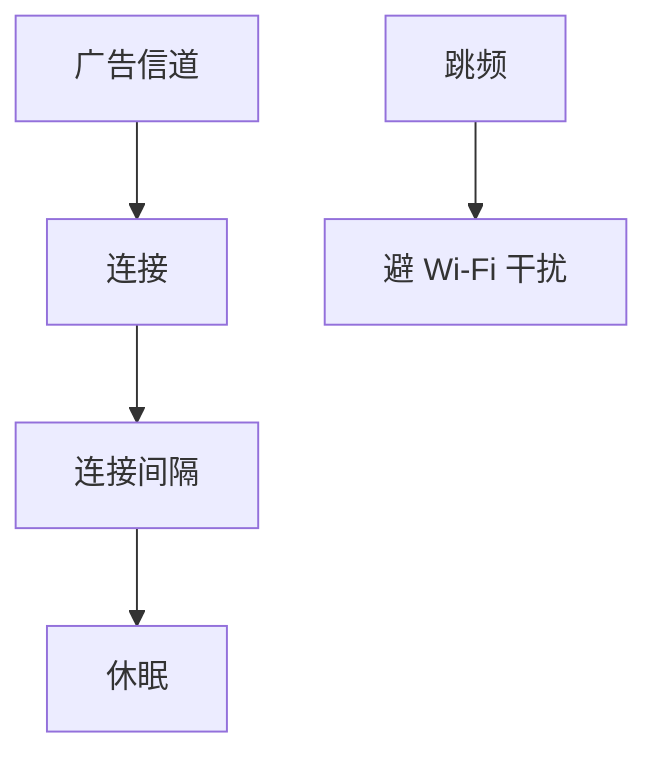

# 蓝牙与 BLE

经典蓝牙用跳频 piconet 扛 2.4 GHz 干扰；BLE 用短广告与连接间隔换电池寿命，不接以太网 MAC 学习那一套。

<footer>—— 据 Bluetooth SIG Core Specification；IEEE 802.15.1 历史对照整理</footer>

[上一课](/cs/wifi6-ofdma) 把 ISM 频段写成宽带调度。键盘、信标、耳机不需要 OFDM 160 MHz。缺口是**个人域网**：经典蓝牙 SCO/ACL 与 BLE 广告、GATT。本课不把蜂窝 RAN 写完。

## 问题

与 AP 争 2.4 GHz：蓝牙跳 79（或 BLE 40）个信道，平均干扰。主从 piconet，不是交换机洪泛。BLE：广播通道发 adv，主机扫描后建立连接，用连接间隔睡觉——容量公式仍成立，但设计目标是 μJ 每比特，不是线速。GATT 属性协议在 L2CAP 之上，相当于这个栈的「应用层」，不要用 HTTP 语义硬套。

不要把 BLE Mesh 写成 OSPF：受控洪泛与 TTL，规模小。

Core Spec 分 Controller/Host。802.15.1 曾把经典蓝牙收进 IEEE，工业以 SIG 为准。本课不把每个 Profile 列完。

### 不是以太网桥

跳频 piconet 与广告间隔为电池服务。GATT 不要套 HTTP 语义。进 IP 要应用网关。与 Wi‑Fi 共存靠自适应跳频。

## 方法

对照：Wi‑Fi 关联 vs BLE 广告/连接；OFDM 宽信道 vs GFSK 窄信道。画：adv → connect → 间隔交换 → 休眠。与自协商对照：BLE 也交换能力，但是 GATT 服务发现。

方法止于选定对象与对照；机制才说它如何嵌入已有分层与主干课。

## 机制

以太网 LLDP 发现交换机；BLE 发现外围设备。都是一跳身份，地址空间与安全模型不同（配对、LE Secure Connections）。不进 MAC 表，不跑 STP。若网关把 BLE 桥到 IP，那是应用网关，不是 802.1Q 桥。

共存：自适应跳频避开 Wi‑Fi 占用的信道，是频谱上的「线路码」式规避，不改香农公式。

## 边界

本课不引入 UWB 测距。蜂窝 RAN 与核心网是下一课。后课默认：蓝牙是短距跳频栈；BLE 为低功耗连接。

音频延迟与 BLE 吞吐上限来自间隔与 PHY 档（1M/2M/Coded），不要用千兆以太网对照当缺陷。

上一课留下的缺口在本课收口；「蓝牙与 BLE」进入后课词汇表后只引用。文献用来钉对象与边界，不把本课写成该主题的独立综述。下一课[蜂窝：RAN 与核心网](/cs/cellular-ran-core)。

## 小结

- 经典蓝牙：跳频 piconet；BLE：广告+间隔休眠。
- 与 Wi‑Fi 共享 2.4 GHz，用跳频共存。
- 不是以太网桥，网关才进 IP。
- 后课只引用本课钉死的对象，不从该领域总问题重开。
- 出处：Bluetooth Core Spec；IEEE 802.15.1。
