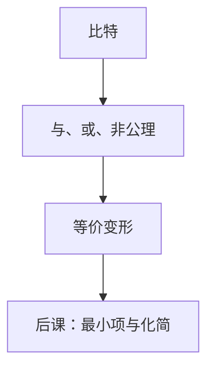

# 布尔代数公理

把真与假当成代数里的两个元，与、或、非就有交换、分配和互补，化简才不是靠猜。

<footer>—— 据 Boole, The Laws of Thought, 1854；Shannon, A Symbolic Analysis of Relay and Switching Circuits, 1938；Harris and Harris, Digital Design and Computer Architecture 整理</footer>

上一课[奇偶与 CRC](/cs/parity-crc)把冗余写成汉明距离，校验位「看起来像异或」，但还没有一套对 $\{0,1\}$ 的运算。本课不重讲码字几何，也不从「逻辑学史」另起。缺口是：比特到现在只有区分、读法和距离，**没有函数**。门电路、后课的组合网络，需要先承认与、或、非满足的公理。

## 问题

纠错的校验、后课的加法器进位，都是「若干比特进、若干比特出」。若每次都列真值表，规模随输入指数涨。缺口因此不是新的物理判决，而是把 $\{0,1\}$ 上的运算做成代数：交换、结合、分配、De Morgan、互补 $x+\bar x=1$、$x\cdot\bar x=0$。有了这些，表达式才能等价变形。

Shannon 1938 把继电器接点与布尔代数对应起来。本课只钉公理与对偶；最小项展开、卡诺图是后课。晶体管实现是[CMOS 反相器](/cs/cmos-inverter)才开始的另一课程。

### 布尔不是「真值表的别名」

真值表是函数的外延。代数给的是改写规则：同一函数可以有许多式子。后课化简要的是更短的式子，不是另一张表。把 $+$ 当成整数加、把溢出规则带进来，会把本课毁掉：这里 $1+1=1$。

Harris 把组合逻辑写成布尔式再画门。Boole 的原书对象更宽；本栏只用二元布尔代数。第一课的 0/1 在这里第一次获得「假/真」解释，仍不绑定高电平。

## 方法

载体 $\{0,1\}$，运算 $\cdot$、$+$、$\overline{\,\cdot\,}$（与、或、非）。公理保证它是有补分配格。对偶原理：把 $0/1$ 与 $\cdot/+$ 对换，定理仍真。任一 $n$ 元函数都是某个式子——存在性下节最小项才构造；本课只要求运算封闭、可结合，以便后课画多级门。

## 机制

有了代数，组合电路的功能可以先写式子再映射到门。等价的式子对应功能相同、延迟和门数可以不同——代价是后课时延才量化。纠错码里的偶校验就是 $x_1+\cdots+x_n$ 在模 2 下；本课的 $+$ 是或，模 2 加是另一运算（异或），后课会当组合块用，本课不把它提升成公理原语。

互补律让「非」成为对合：两次非回到自身。这是后课反相器链的功能面；电气上的奇数个反相器振荡，是器件课的缺口。

## 边界

本课不引入时序、不把布尔环（$\mathbb{F}_2$ 上的多项式）整章搬进来，也不讨论多值逻辑。集合论还没有：布尔代数可以解释成幂集运算，那是[集合与关系](/cs/sets-relations)的对照，不是本课定义。

后课默认：组合功能是布尔函数；化简与实现都在这套公理上改写，不再从 Boole 重讲。

## 小结

- 与、或、非满足交换、分配、De Morgan 与互补。
- $1+1=1$，不是整数加；异或是后课组合块。
- 公理给等价变形；最短式与真值表枚举是后课。
- 出处：Boole, 1854；Shannon, 1938；Harris and Harris。
