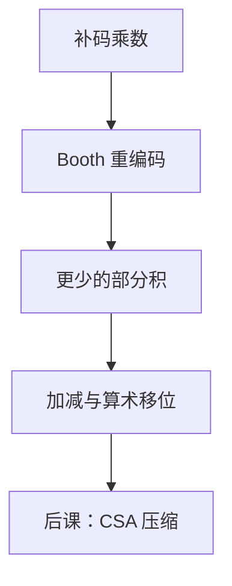

# Booth 乘法

  
补码乘法不必先取绝对值再贴符号：把乘数里连续的 1 收成一次加与一次减，部分积的条数跟着游程走，而不是跟着每一位走。

  <footer>—— 据 Booth, A Signed Binary Multiplication Technique, QJMA 1951；Harris and Harris, Digital Design and Computer Architecture 整理</footer>

[上一课](/cs/proof-assistants)把计算理论补层封口：证明是可检查的依值项。本课程改走数字系统——ALU、HDL、DRAM、PCIe——不再谈类型论，也不重写 Transformer、不进限价簿。组成主干的[阵列乘法](/cs/array-multiplier)已把无符号部分积铺开，并明确把有符号与 Booth 排除。缺口是：**补码操作数**如何少做几次加，而不是再画一遍与门阵列。

## 问题

阵列对每一位 $a_i$ 都可能加一次移位后的 $b$。补码里连续的 $1$ 表示一段已经「快满」的权：例如 $0111_2=8-1$。Booth 观察：$k$ 个连续 $1$ 等价于在这段的高位加一次、低位减一次。缺口因此不是新的乘法定义，而是把乘数重编码，让部分积从「每比特一条」变成「每游程一对加减」。

本课只钉基数-2 的 Booth 与其基-4 改良（两位一组看 $a_{i+1}a_ia_{i-1}$）。华莱士压缩树是下一课的缺口。

### Booth 不是「先变正再乘」

取绝对值、无符号乘、再按符号位异或贴回，多一次取负，且零与最小负数（$-2^{n-1}$）要特判。Booth 直接在补码上加减移位后的被乘数，与[补码](/cs/twos-complement)同一套加法器。把 Booth 理解成符号处理的软件例程，ALU 里那条独立乘通路会对不齐。

Booth 1951 的原文是机械/台式计算器语境；Harris 把它收成数字电路积木。Patterson/Hennessy 把乘除放到整数乘除单元，不塞进与 `add` 同深的单周期框。

## 方法

考察乘数相邻两位 $(a_i,a_{i-1})$（约定 $a_{-1}=0$）：$00$ 与 $11$ 什么都不加；$01$ 加被乘数；$10$ 减被乘数。然后算术右移，进入下一位。基-4（modified Booth）：一次看三位，部分积取 $\{0,\pm B,\pm 2B\}$，条数大约减半。$\pm 2B$ 是接线左移，不必另造乘法器。

阵列仍可生成全部部分积再加；Booth 只改变**有哪些非零部分积**。有符号扩展：被乘数在阵列里要按补码符号扩展到 $2n$ 位宽，否则高位权错。

## 机制

后课华莱士树吃的是已经对齐的部分积，不关心它们来自逐位与还是 Booth。RV32M 的 `mul`/`mulh` 可以在同一阵列上取低/高 $n$ 位；Booth 编码是微结构选择，不是新 opcode。组成课已强调：组合乘的关键路径长于一次 [CLA](/cs/adder-cla)，Booth 减的是加法器个数与部分积高度，末级进位链仍在。

## 边界

本课不画华莱士点图，不引入 SRT 除法，不把 DSP48 的 25×18 硬核当 Booth 的定义。浮点尾数乘是无符号阵列加后规格化，符号单独 XOR——那是后课 FMA，不在这里混进补码 Booth。

后课默认：有符号整数乘可用 Booth 把连续 1 收成加减；部分积仍要被多操作数加法吃掉。

## 小结

- 计算理论已封口；本课打开算术单元：补码乘的部分积编码。
- Booth：游程变成一次加与一次减；基-4 进一步减条数。
- 不是先取绝对值；与补码加法器同一套。
- 出处：Booth, *QJMA*, 1951；Harris and Harris；Patterson and Hennessy, COD (RISC-V)。
