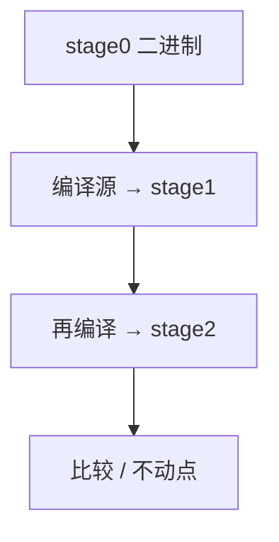

# 自举

用已有编译器编译新编译器的源，再用新编译器编译自己，直到二进制不动点。信任问题：第一份二进制从哪来。

<footer>—— 据 Thompson, Reflections on Trusting Trust, 1984；Wirth 自举传统；对照 CompCert 抽取整理</footer>

上一课[Csmith](/cs/compiler-fuzzing) 测的是已得到的编译器。本课收束「程序语言与编译进阶」：缺口是**自举链**——Rust/GHC/Go 都用上一代编下一代。第一课 [lex/flex](/cs/lex-flex) 从 word RAM 转入生成器；现在回到信任基。下一课程操作系统进阶从 [FAT](/cs/fat-filesystem) 起，不在本课打开 VFS。

## 问题

新语言没有编译器。阶段：用 C 写一个子集编译器，再扩展，直到能编自己。不动点：`cc_new(src) == cc_old(src)` 的二进制（或 ABI 允许的等价）。缺口是**阶段与信任**，不是差分测试。

Thompson：编译器可插入后门且自复制，源码审计不够。对策：多样编译器比较、从更小信任基重建（Guix 引导点名）。

### 自举不是「递归函数」

是工程过程，不是 $Y$ 组合子。不要和[递归定理](/cs/recursion-theorem) 混为一谈，尽管都有「自己谈自己」。

Thompson 1984 Turing 演讲。GHC stage。Rust bootstrap。CompCert 用 Coq 抽取，信任核不同。本课不写完整可引导发行版。

## 方法

保留 stage0 二进制。stage1：stage0 编源。stage2：stage1 再编，应与 stage1 输出一致（或可解释的差异：路径嵌入）。交叉自举：用三元组在主机上为 target 产出。

与 LTO/PGO：自举配置要钉死，否则二进制永远不等。

## 机制

时间戳、随机、`__DATE__` 破坏可复现。可复现构建是自举验证的朋友。不要在自举时混主机头文件——[交叉](/cs/cross-compile-triple)。

多样复现：两份无关编译器编同一源，比 Thompson 后门。

## 边界

本课不写内核引导。后课默认：语言实现靠自举链；信任可被 Thompson 攻击，需多样重建。程序语言与编译进阶到此结束；下一课 [FAT](/cs/fat-filesystem)。

也不把自举当生物课。

## 小结

- 自举：用编译器编译自己，直到二进制稳定。
- Thompson：恶意编译器可存活在二进制里。
- 与 CompCert/Csmith：证明、测试、信任链三条腿。
- 出处：Thompson, 1984；对照 Leroy、Yang et al.；GNU/LLVM 自举实践。
