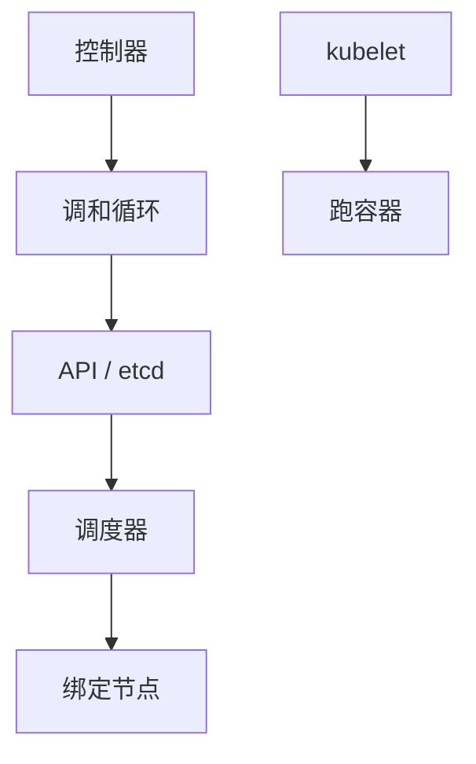

# Borg 与 Kubernetes

集群操作系统：调度把任务放到机器上，控制面是强一致的小状态，数据面是最终一致的调和。声明式对象不等于一次 RPC 的线性化点。

<footer>—— 据 Verma et al., Large-scale cluster management at Google with Borg, EuroSys 2015；Burns et al., Borg, Omega, and Kubernetes, CACM 2016 整理</footer>

上一课[分布式文件元数据](/cs/distributed-fs-metadata)给了卷的一种来源。缺口是**谁把进程放到哪台机器**：调度、隔离、控制器。本课钉 Borg 与 Kubernetes 的控制面形状，不重写 Linux cgroup。后课 Tail at Scale 解释为何调度与多租户制造长尾。

## 问题

Borg：作业、任务、配额、抢占、机器失败就在别处重启。单元（cell）里有 Borgmaster 复制状态。Kubernetes：API 对象存 etcd（[etcd/Chubby](/cs/etcd-chubby)），控制器 watch 后调和到期望态——调和循环是[最终一致](/cs/eventual-consistency)，etcd 里对象写是线性一致。缺口：把 `kubectl apply` 当全集群瞬间完成。调度器看到的是缓存的快照，决策可过时，靠再调和。

Omega 的共享状态调度、乐观并发是亲戚，Burns 文对照三代。

EuroSys 2015 讲 Borg 生产。CACM 2016 讲设计迁移。本课不把 YAML 当理论。

## 方法

控制面：少数主，CP。kubelet/代理：本机，失败隔离。调度：过滤 + 打分；绑定写回 etcd 带资源版本（乐观锁）。抢占与优先级处理过载，不是限流课的令牌桶，但同族。

不要把滚动升级（后课）当成调度算法本身；它是控制器对副本集的调和。

## 机制

故障：机器没心跳，任务被重新调度，本地盘要当临时。与[租约](/cs/leases)：节点心跳是检测器。脑裂：两个调度器若不用资源版本会双绑——etcd 条件写是 fencing。

本课不写服务网格。也不写 LLM 训练作业调度。

多租户尾延迟：邻居 noisy，cgroup 不完美，这是 Tail at Scale 的输入。隔离档（best effort vs guaranteed）是 Borg 已有分类。

## 边界

本课不列全部 API 对象。后课默认：编排 = 强一致存储 + 最终一致调和；读到「已 Running」不表示所有副本同时切完。下一课把规模下的尾从机房层再钉一次。地理复制课处理多集群，不在本课。

声明式把重试变成调和。调和不是 2PC。

## 小结

- Borg/k8s：控制面 CP，控制器最终一致调和。
- 调度绑定用对象版本防双绑。
- 机器失败靠检测与在别处重启，本地状态要可丢。
- 出处：Verma et al., EuroSys 2015；Burns et al., CACM 2016。
