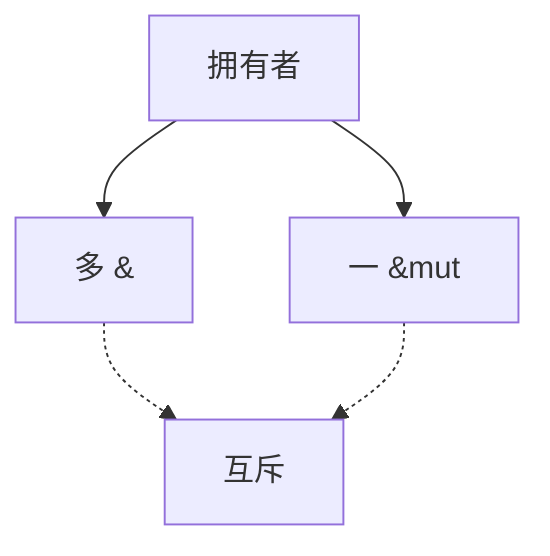

# 借用检查

在唯一所有权之上，允许临时共享：同一时刻要么多个只读借用，要么一个可变借用。检查的是别名纪律，不是运行时锁。

<footer>—— 据 Rust 所有权与借用规则（Matsakis 等）；Grossman 等 Cyclone；对照 Reynolds 干扰控制整理</footer>

上一课[线性与所有权](/cs/linear-ownership)禁止别名。实用程序要只读共享与短暂可变。缺口是**借用**：`&T` / `&mut T` 不转移所有权，但限制拥有者在借用期间的使用。本课钉互斥规则与「冻结」，不把区域推断写完——下一课生命周期。

## 问题

若允许 `&mut` 与 `&` 同时存在，只读方看见的值可被改，或两个 `&mut` 数据竞争。规则：活跃借用集合里，可变与任何其它借用互斥。缺口是**静态别名集**，不是[别名分析](/cs/alias-analysis)那种中端优化（后者保守允许「可能别名」；借用检查失败则拒绝程序）。

NLL（non-lexical lifetimes）把活跃区间从作用域缩到最后一次使用。这是检查精度，不是新语义。

### 借用不是 GC 根

借用不延长堆对象到「程序结束」；它要求对象已有拥有者活着。悬空借用由生命周期拒绝，下一课。本课先钉同一函数内的冲突。

Cyclone 是 Rust 之前的安全 C 方言。Rust RFC 与 NLL 设计是工程来源。本课不引用虚构 arXiv。Appel 的安全讨论可对照，但不把 Rust 写进 Appel 原书。

## 方法

对每个位置维护：拥有者是否被移走、只读借用计数、是否有可变借用。赋值、`&mut` 再借用、分裂借用（字段不重叠）是精细规则。失败：诊断指出第一次借用与冲突使用。

与[值限制](/cs/let-polymorphism)：借用不引入 `ref` 多态那种洞，因为可变借用已钉死唯一写者。

## 机制

内部可变性（`Cell`/`RefCell`）把检查推迟到运行时或用 Unsafe 包起来。类型系统在安全子集里仍成立。不要用「全是 `unsafe`」当借用检查的定义。

内部字段借用：结构体拆借合法当字段不相交；这是静态形状，不是依值长度。

## 边界

本课不写跨函数的区域。后课默认：同时多读或一写。下一课生命周期与区域：借用能活多久、如何标进类型。

也不把 Python GIL 当借用检查。

## 小结

- 借用 = 不移动所有权的临时别名，带互斥。
- 检查拒绝，而不是插入锁。
- NLL 按最后使用结束借用。
- 出处：Cyclone；Rust 借用规则；对照 Reynolds、Girard/Wadler 线性。
