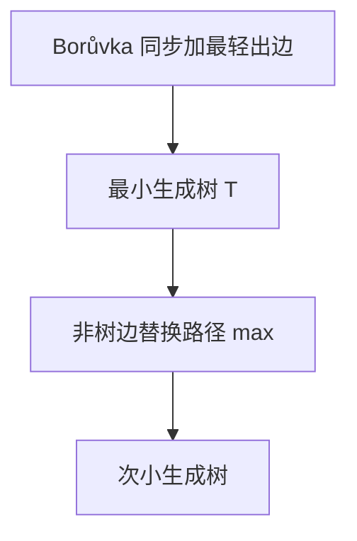

# Borůvka 与次小生成树

每个连通块同时抓住出块最轻边，一轮收缩；次小生成树则在 MST 上换一条边：树上路径最大边与非树边的最小正替换。

<footer>—— 据 Borůvka, 1926；Tarjan, Sensitivity Analysis of Minimum Spanning Trees, 1982；CLRS 第 23 章整理</footer>

上一课[Kruskal 重构树](/cs/kruskal-reconstruction)把 MST 加边史做成查询树。主干 Kruskal/Prim 已给一棵 MST。缺口有两块：Borůvka 的**并行长树**（也是切分定理），以及**严格次小生成树**——边集不同、权和次小。不重写切分定理。后课离开生成树，进入费用流。

## 问题

Borůvka：初始每个点一块。同步：每块选一条跨块最轻边（平权要定规则以免环）。加入这些边，收缩。至多 $O(\log n)$ 轮，每轮 $O(E)$，总 $O(E\log V)$。适合并行；也是 Prim/Kruskal 之外第三种经典 MST。

次小：在 MST $T$ 上，对每条非树边 $(u,v)$，替换 $T$ 上 $u$–$v$ 路径的最大边，得到另一棵生成树。所有这种替换里权和最小者即（严格）次小——若要求边集不同，平权时可能要次小替换。实现：树上倍增维护路径 $\max$，扫非树边 $O(E\log V)$。

缺口是「换一条边」，不是再求 MST。

### 次小不是次小边

次小生成树与「第二小的那条边」无关。可能换掉的是内部一条大边。也不要 Borůvka 每块选次轻当次小树——那一般错。

Borůvka 1926（Otakar Borůvka）早于 Kruskal/Prim。次小生成树的替换分析见 Tarjan 等关于 MST 敏感度的工作。CLRS 23 点名 Borůvka。后课最小费用流换容量与费用，不再是无向生成树。

## 方法

MST：Borůvka 或沿用 Kruskal。次小：先 MST；预处理树路径 $\max$；枚举非树边算 $\Delta=w(e)-\maxPath$；取最小正 $\Delta$ 加上 $w(T)$。$\Delta=0$ 表示有另一棵同权 MST。

不连通则生成森林，次小说同一连通块内。

## 机制

Borůvka 每轮块数至少减半（每块至少合一次，若图连通），故对数轮。安全边仍来自切分。替换定理：任一与 $T$ 差一条边的生成树都是「加非树边、删圈上另一边」；权和变小当且仅当删的比加的重。故最优次小在「删路径最大边」里产生。

与重构树：LCA 给出路径 $\max$，正是本课替换要用的量。

## 边界

本课不写 $k$ 小生成树枚举全套、不写有向 Chu–Liu。动态 MST 不写。后课默认：MST 三种经典算法；次小 = 树上路径 max 替换。下一课最小费用最大流，边有容量与费用。

## 小结

- Borůvka：块同步抓最轻出边，对数轮。
- 次小生成树：MST 上非树边替换路径最大边。
- 切分定理共用；与瓶颈重构树接口是路径 $\max$。
- 出处：Borůvka, 1926；MST 敏感度见 Tarjan, 1982；CLRS 第 23 章。
