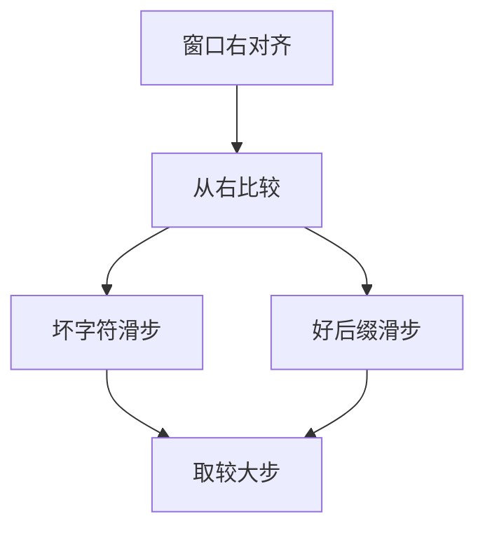

# Boyer–Moore

模式从右往左比；失配时坏字符与好后缀规则可以把模式向右滑出多格，文本指针不必像朴素那样只走一格。

<footer>—— 据 Boyer and Moore, A Fast String Searching Algorithm, 1977；CLRS 第 32 章整理</footer>

上一课[KMP 串匹配](/cs/kmp)预处理模式的前缀函数，扫描文本只前进，最坏 $\Theta(n+m)$。本课不重算 $\pi$。缺口是另一条工程主路：对齐窗口内**从右端比**，用失配字符在模式中的最后出现、以及已匹配后缀的重现，计算滑步。平均常亚线性扫描文本；最坏仍须小心，本课钉规则不把所有最坏变体写完。后课多模式换成自动机。

## 问题

KMP 保证最坏线性，文本每个字符都进转移。Boyer–Moore：窗口右端对齐，先比 $P$ 的末字符。若 $T$ 该位是 $c$ 且 $P$ 末位不是 $c$，把 $P$ 滑到使某次出现的 $c$ 对齐（没有则整模式滑过 $c$）——坏字符规则。若已匹配了一段后缀，好后缀规则滑到该后缀在 $P$ 中的上一次出现，或滑到与后缀一致的前缀。两规则取较大步。

缺口是「可以跳着读 $T$」，不是哈希。仍要确定性、精确匹配。字母表大时坏字符常一步跨很远；字母表小、模式周期强时好后缀更关键。

### 从右比不是「倒着跑 KMP」

KMP 的 $\pi$ 来自前缀自匹配。BM 的表来自字符出现位置与后缀重现。不要把 $\pi[q]$ 当坏字符位移。Sunday、Horspool 是简化：只用坏字符的变体，本课点名不展开。

Boyer–Moore 1977，CACM。CLRS 第 32 章以 KMP 为主，BM 作注释级对照。本课把它收进主干，因为词法与检索实现经常先写 BM/Horspool。

## 方法

预处理：每个字符在 $P$ 中最右下标；好后缀表（对每个已匹配长度的滑步）。匹配：对齐 $s$，从 $P$ 右端比较；全中则报告，$s$ 再加好后缀步找下一处；失配取两规则最大值更新 $s$。

预处理 $O(m+|\Sigma|)$ 量级。不要在未预处理时「每次现算最右出现」而不摊到表上——那会把常数写乱，渐近仍可，但不是本课的算法。

## 机制

亚线性：许多窗口只读右端一个字符。最坏可到 $\Theta(nm)$（某些教材变体）；Galil 规则等补丁回到线性，本课点名：要最坏线性，KMP 更干净。本课对象是精确单模式；正则仍是编译课。

与[散列](/cs/hash-function)：Rabin–Karp 是滚动指纹，模型不同。

## 边界

本课不做近似匹配、不写二维。多模式下一课 Aho–Corasick 一次扫 $T$。后课默认：单模式精确，KMP 最坏线性，BM 平均跳读。多模式共享前缀时不要对每个 $P$ 各跑一遍 BM。

## 小结

- BM 从右比，坏字符与好后缀决定滑步。
- 平均常少读 $T$；最坏线性仍以 KMP 为定理级保证。
- 单模式；多模式是下一课自动机。
- 出处：Boyer and Moore, 1977；CLRS 第 32 章。
