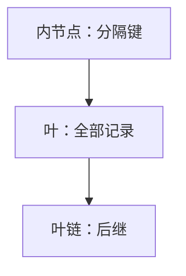

# B+ 树作为结构

内节点只存分隔键与孩子指针，真正的记录全在叶上；叶再串成有序链表，范围扫描不必回到根。

<footer>—— 据 Bayer and McCreight, Organization and Maintenance of Large Ordered Indexes, 1972；Comer, The Ubiquitous B-Tree, CSUR 1979 整理</footer>

[上一课](/cs/btree-external)钉了高扇出、叶同深、满则分裂，并声明卫星可在内节点、B+ 细节后置。数据库栏的[B+ 树索引](/cs/bplus-index)会谈 rid 与缓冲池。本课不重写库存储，也不从 Bayer 的总问题另起。缺口是把 B+ 当作内存/外存都可用的**有序字典表示**：数据只在叶、内节点当路标、叶链支持后继迭代。堆课马上要用「不必全序遍历」的对照。

## 问题

B 树内节点带记录，范围扫描要中序走内节点，页内布局与叶不同。B+ 约定：查找总是降到叶；内节点的键只是分隔，可以是叶中键的副本。缺口不是再证 $\Theta(\log_t n)$ 高度，而是**后继 = 叶上右邻，或叶链下一页**，从而顺序遍历对 I/O 与 cache 都是连续的。

分裂：叶满则对半，中位键**拷贝**上推（叶仍留该键）；内节点满则中位**上移**。这与 B 树「记录跟着键走」不同。

本课对象是结构。聚簇、二级索引、覆盖扫描是数据库课用同一结构干的事，不在这里重讲。

## 方法

查找：内节点二分选孩子直到叶，叶内再找。插入只在叶分裂；分隔键上传可能级联。范围 $[L,R]$：找到 $L$ 所在叶，沿 `next` 走到超过 $R$。

内存里 B+ 仍改善扫描局部性：叶可以是大块数组。扇出由页或 cache 行宽决定，与上一课相同。

## 机制

点查 I/O 次数仍是高度；范围的额外 I/O 与输出页数成正比，而不是与树的内部路径成正比。这是相对 BST「后继可能上爬」的优势，也是相对散列「无序」的优势。

内节点键可压缩（前缀），只影响扇出，不影响「数据在叶」。删除合并与 B 树对称；实践可惰性标删，结构课只要求不变式可恢复。

## 边界

本课不引入哈希索引、WAL、蟹行锁。也不把 B+ 写成必须外存：内存有序字典同样能用。优先队列不需要中序与范围，下一课用堆，避免为 extract-min 维护整棵多路树。

后课默认：要有序、要范围、要高扇出，用 B 树族；B+ 是扫描友好的变体。只要反复取最小，用堆。

## 小结

- B+：记录只在叶，内节点是路标，叶链走范围。
- 分裂时叶键拷贝上推，与 B 树记录上移不同。
- 优先队列合同更窄，下一课堆。
- 出处：Bayer and McCreight, 1972；Comer, *CSUR*, 1979；对照 CLRS B 树章。
