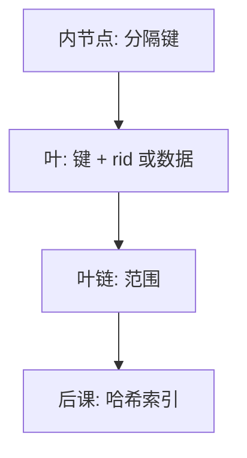

# B+ 树索引

内节点只指路，叶节点拉成有序链表；等值与范围都从同一棵矮树走。

<footer>—— 据 Comer, The Ubiquitous B-Tree, CSUR 1979；对照[B 树与外存](/cs/btree-external)</footer>

[上一课](/cs/heap-cluster)区分了堆与聚簇。本课不重讲空闲空间图。[B 树与外存](/cs/heap-cluster)已经给出多路平衡查找树为何适合分页。缺口是：数据库里实际用的是 **B+ 树**——数据（或 rid）只在叶上，内节点是分隔键，叶用兄弟指针支持范围扫描。

## 问题

数据结构课的 B 树允许内节点也存记录。库的二级索引要稳定、要扫一段键、要尽量少改内节点。缺口不是再证对数高度，而是约定：查找从根到叶，范围沿叶链走，插入分裂仍保持平衡。聚簇索引可以让叶即数据页；非聚簇叶只存键与 rid，再回[堆](/cs/heap-cluster)。

扇出由页大小与键长决定。前缀压缩、后缀截断提高扇出，本课承认它们是页内技巧，不改变树的形状不变量。

## 方法

查找：内节点二分选子页，直到叶。等值命中后沿叶链收集重复键（非唯一索引）。插入在叶；满则分裂，中键上推，可能级联到根（长高一层）。删除可合并或与兄弟借键，实践中常惰性标删，以免频繁合并。本课不把并发锁耦合（蟹行、右链）写完，那是后课锁与 MVCC 的交界。

## 机制

B+ 使范围与排序扫描成为一等公民：`ORDER BY` 与归并连接可以直接吃叶序。覆盖索引若叶上列够用，可免回表。高度通常二三层，缓冲池常把根与上层钉住，点查接近一两次 I/O。这与[代价估计](/cs/cost-estimate)里的索引高度项对齐。

主键约束常靠唯一 B+ 实现：插入前在叶上探测。这是完整性的物理手段，含义仍在[键与完整性](/cs/keys-integrity)。

内节点不存 rid，分裂时上推的是分隔键。这使叶链扫描不必回到根。

## 边界

本课不把 LSM、跳表、GiST 请进主干。也不讲倒排、全文。哈希下一课才对照：等值快、范围弱。并发下的结构修改（SMOs）与 WAL 日志必须原子出现，细节在恢复课。

复合键与包含列（covering）只改变叶上存什么，不改变「内节点指路、叶上有序」这一条。后课默认：说到二级索引，默认 B+；等值点查也可以走哈希，范围仍走 B+。

B+ 的矮来自页级扇出，不是来自内存 BST 的旋转。外存课已经讲过多路；本课只钉叶链与回表。

## 小结
- 覆盖索引免回表，叶上必须带齐查询需要的列，这是空间换 I/O。
- 唯一约束常落在 B+ 叶探测上，含义仍在键课。

- 堆/聚簇已在；本课把 B 树特化成叶链表的 B+ 索引。
- 等值走根到叶，范围走叶链；回表与否则看聚簇。
- 等值专用的哈希索引是后课对照。
- 出处：Comer, 1979；Ramakrishnan and Gehrke；对照 Knuth 外存查找。
