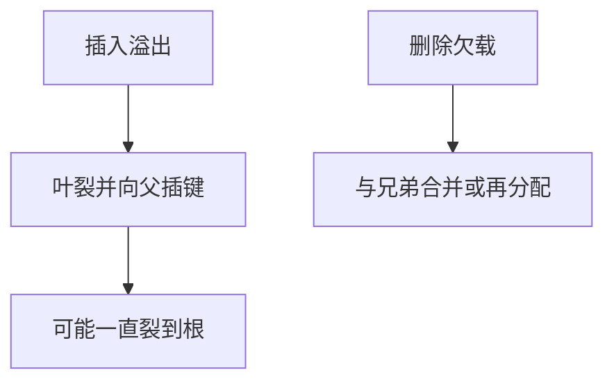

# B+ 分裂与合并

叶满则分裂并向上插分隔键；欠载则与兄弟合并或再分配，树保持矮而平衡。

<footer>—— 据 Comer, The Ubiquitous B-Tree；Ramakrishnan and Gehrke 对 B+ 维护的整理</footer>

[上一课](/cs/bplus-index)给出 B+：内节点指路，叶拉成链表。本课不重画查找。缺口是更新：插入使叶溢出，删除使叶过空。分裂/合并沿祖先传递，可能加高树。哈希索引下一课才对照等值路径。

## 问题

B+ 课留下静态结构。数据库的插入删除是常态。叶分裂：一半键留下，一半到新页，父节点插入分隔键；父满则继续裂。根裂则长高一层。合并是逆操作，常设低水位以免振荡。缺口是**维持占用率与平衡的机制**，与内存 [AVL 旋转](/cs/avl-rotate) 同目标、另一套页 I/O。

右分隔键的复制还是上移，实现有变体。并发下要锁住祖先或用锁耦合，后课库内锁再谈，本课先串行维护。

## 方法

插入：找到叶，有空槽则插；否则裂。删除：叶内删，过空则借或并。范围扫描沿叶链走，分裂时必须同时维护兄弟指针。聚簇索引上分裂会移动行，rid 若按页槽则要稳定策略（后课页槽）。

## 机制

分裂把一次插入的 I/O 从「改一页」变成「改一串祖先」，这是 B+ 写放大的来源。WAL 后课会把这些页改写进日志。查找高度仍是对数，因为裂是平衡的。覆盖扫描在叶上走，会看见分裂中的短暂不一致——并发协议后补。

## 边界

本课不把 B-link 树的全部无锁方案写入主干。等值点查询若不需要范围，哈希索引是另一结构，下一课。

后课默认：B+ 在更新下保持平衡。等值可用哈希路径。

## 小结

- 溢出分裂、欠载合并，树保持平衡。
- 写放大来自祖先链。
- 哈希索引下一课。
- 出处：Comer, *CSUR* 1979；Ramakrishnan and Gehrke。
