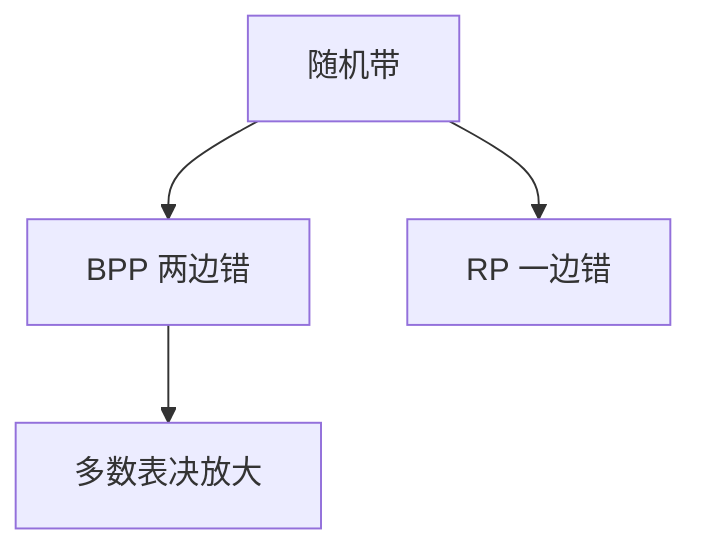

# BPP 与随机复杂类

BPP 是两边错误都可放大到指数小的多项式随机算法；RP、coRP 只许一边错。它与 PH 的关系，比「实践中等于 P」更细。

<footer>—— 据 Gill；Motwani and Raghavan；Arora and Barak 整理</footer>

上一课[coNP 与 PH](/cs/conp-polynomial-hierarchy) 是量词。主干[随机化算法](/cs/randomized-algo) 已分 Las Vegas / Monte Carlo，并点名 BPP。缺口是**类**：BPP、RP、ZPP，错误放大，以及 $P\subseteq BPP\subseteq PH$ 的课堂事实（Sipser–Gács–Lautemann）。不重做快排。

## 问题

多项式时间 TM 外加随机带。BPP：对一切 $x$，错概率 $\le 1/3$（两边）。重复独立并多数表决，Chernoff 把错误打到 $2^{-n}$，仍多项式。RP：是实例至少 $1/2$ 接受，否实例永不接受（一边错）。ZPP：期望多项式、总正确（Las Vegas），$\mathrm{ZPP}=RP\cap coRP$。素性：历史是 RP，后进 P（AKS）；本课当形状，不写 AKS。

未知 $P=BPP$。电路下界若够强可去随机化，点名不证。

### $1/3$ 不是魔法

只要与 $1/2$ 有常数隙，放大就成立。把隙缩到 $1/2-1/n$ 要更多重复，仍多项式。隙 $2^{-n}$ 则未必。

Gill 定义 BPP。Lautemann / Sipser–Gács 把 BPP 放进 $\Sigma_2^p\cap\Pi_2^p$。Motwani–Raghavan 与算法课衔接。本课不把密码学的「可忽略」当定义，那是后课单向函数。

## 方法

写错误放大：重复 $t=O(\log(1/\delta))$ 次。对照 RP 只能「接受则相信是」，拒绝可能是坏硬币。画包含：$P\subseteq ZPP\subseteq RP\subseteq BPP\subseteq PH$。

[离散概率](/cs/discrete-probability) 的期望与独立已有；这里只把类接上。

## 机制

BPP 对补封闭（翻答案）。NP 不是这样定义的。随机性是资源，不是证书：证书必须对 Yes 存在且可验；硬币对每个输入都抽，允许小概率错。把 BPP 算法的随机带当证书，会把否实例的坏硬币误当证明——所以 BPP 不显然在 NP。

Sipser–Gács–Lautemann：BPP 的随机位可换成 $\Sigma_2$ 量词（存在多数好种子、对坏种子全称）。因此 $BPP\subseteq PH$。密码学若有足够强的 PRG，BPP 可去随机化到 $P$——那是假设，不是定理。RP 的一边错不能用翻答案变成 BPP 的对称，除非同时有 coRP。

## 边界

本课不证 BPP $\subseteq$ PH 的交换量词证明全文，不引入 AM。不把量子 BQP 提前。后课默认：BPP 两边错可放大；实践中的 Monte Carlo 多项式算法落在此类。下一课交互：IP。

随机带对每个输入重抽，允许小概率错；NP 证书必须对 Yes 存在且可验。把硬币当证书会把坏硬币误当成证明。错误放大要求与 $1/2$ 有常数隙。

上一课留下的缺口在本课收口；「BPP 与随机复杂类」进入后课词汇表后只引用。文献用来钉对象与边界，不把本课写成该主题的独立综述。

## 小结

- BPP：多项式、两边错、可放大；RP 一边错；ZPP 期望多项式。
- $BPP\subseteq PH$；是否等于 $P$ 开放。
- 随机带不是 NP 证书。
- 出处：Gill；Motwani and Raghavan；Arora and Barak。
