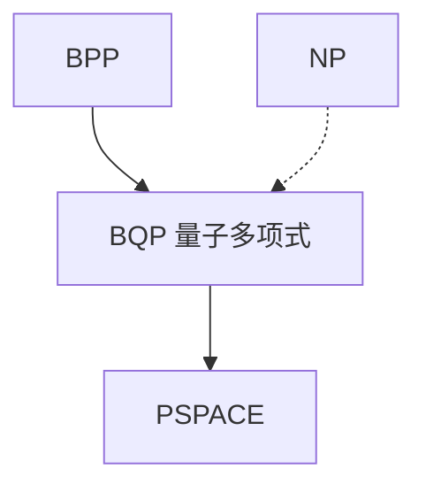

# BQP 直觉

BQP 是量子电路多项式规模、测量错误可放大的语言类。它含 BPP，被相信不含 NP 完全问题，却能因子分解。

<footer>—— 据 Bernstein and Vazirani；Shor；Watrous；Arora and Barak 整理</footer>

上一课[单向函数](/cs/one-way-functions-avg) 停在经典平均。缺口是给量子多项式类一个**位置**，不是量子力学课，也不是大模型。BQP：均匀多项式量子电路，接受概率与 BPP 同类缝隙。Shor：因子在 BQP。NPC 是否在 BQP 未知，普遍不信。

## 问题

量子电路：幺正门 + 测量。状态空间 $2^n$ 维，但描述必须均匀生成。BPP $\subseteq$ BQP：经典硬币可模拟。BQP $\subseteq$ PSPACE：用多项式空间算振幅递归（对指数维求和要小心，但配置可递归）。与 NP：无已知把 SAT 放进 BQP 的算法；Grover 是平方加速，不是指数。

广义 Church–Turing：若物理量子可实现，则「有效」大于 BPP。本课不争论物理。

### 不是「量子 = 指数并行」

叠加不是 $2^n$ 份经典答案的免费读取。干涉必须设计；测量只给一帧。把 BQP 写成 PSPACE 的子集已经限制了「全能」。

Bernstein–Vazirani 定义 BQP。Shor 1994 因子与离散对数。Watrous 的量子复杂度综述。本栏不重写量子力学公理，只定位类。

## 方法

画包含：$P\subseteq BPP\subseteq BQP\subseteq PSPACE$，NP 旁支。点名 Shor 击穿的是因子 / 离散对数假设，不是 OWF 全体（格、后课 LWE 仍候选）。不要给量子门清单当主线。

## 机制

复杂性补层到此：时间、空间、随机、交互、PCP、电路、参数、平均、量子，都挂在 TM / 电路模型上。下一单元换尺子：Shannon 信息。BQP 不进入那一单元的公式。

因子在 BQP 而未知在 P，是「BQP 可能真大于 BPP」的最强课堂证据，仍非证明。

Grover 把无结构搜索从 $N$ 降到 $\sqrt{N}$，仍指数于比特数。Shor 用周期发现打因子与离散对数，不打一般 NPC。QMA 是量子 NP 类似物，本课不进。把 BQP 画在 $PSPACE$ 内，已经禁止「读出全部振幅」。复杂性单元到此结束。

## 边界

本课不推导 Shor，不引入量子纠错、QMA。不把量子退火当 BQP。后课默认：BQP 是量子多项式类，含因子，不自动吞 NP。下一课信源编码定理，接[熵](/cs/entropy-bits)。

BQP 含因子分解，被画在 PSPACE 内，且不默认含 NPC。广义 Church–Turing 是否要扩到量子，是物理与模型的交界，本课只定位类。信息论单元不再用振幅。

上一课留下的缺口在本课收口；「BQP 直觉」进入后课词汇表后只引用。文献用来钉对象与边界，不把本课写成该主题的独立综述。

## 小结

- BQP：多项式量子电路 + 可放大错误。
- $BPP\subseteq BQP\subseteq PSPACE$；Shor 把因子放进来。
- 叠加不是免费指数；NPC 不默认在 BQP。
- 出处：Bernstein and Vazirani；Shor；Watrous。
