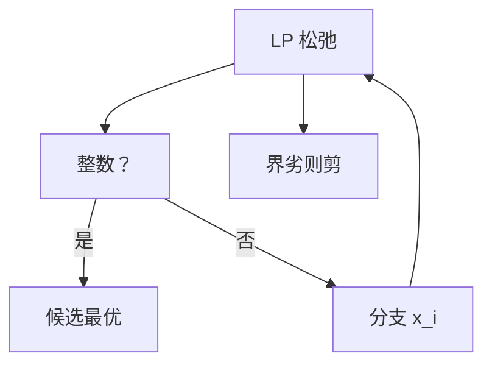

# 分支定界与整数规划

整数约束使顶点不必最优；松弛 LP 给界，分数变量分支，界差则剪枝。

<footer>—— 据 Land and Doig, An Automatic Method of Solving Discrete Programming Problems, 1960；CLRS 第 34 章与标准 ILP 整理</footer>

上一课[LP 对偶](/cs/lp-duality)在连续多面体上强对偶。整数线性规划（ILP）：$x\in\mathbb{Z}$。NPC（含 0-1 背包判定、顶点覆盖）。缺口是分支定界：解 LP 松弛，对分数 $x_i$ 分成 $\le\lfloor x_i\rfloor$ 与 $\ge\lceil x_i\rceil$，用界剪掉。不重写单纯形。后课内点法仍连续。

## 问题

可行整数点是格点。松弛最优 $z_{LP}\ge OPT$（最大化）。若松弛整数则结束。否则分支。全局上界用各叶松弛；下界用已知整数可行。$z_{LP}$ 小于当前可行则剪。切割平面（Gomory）切掉分数顶点但留整数，可与分支合用（branch-and-cut）。

缺口是这棵搜索树，不是再证 NPC。

### 松弛不是近似算法

$z_{LP}/OPT$ 可以任意差（某些公式）。近似比后课。本课要精确最优，最坏指数。

Land–Doig 1960。Gomory 割。TSP 的 Held–Karp 松弛是著名 LP 界。后课内点走多面体内部，仍非整数。

## 方法

选变量分支（最分数、伪代价）。选结点：最佳界或深度。启发式找整数可行当全局下界。切平面可选。

对称性破坏、预处理很重要，本课点名。

## 机制

有限分支（变量有界时）故终止。正确性：最优在某叶。与 Held–Karp 子集 DP：那是固定状态；这里状态是约束分支，适合通用 ILP。与贪心：无保证。

## 边界

本课不写求解器内部启发式全书。不写半定松弛。后课默认：ILP 精确用分支定界 + 松弛界。下一课内点法直觉（连续 LP）。

## 小结

- 整数使对偶间隙可能为正。
- 分支 + LP 界 + 剪枝 = 精确搜索。
- 最坏指数；实践靠界的质量。
- 出处：Land and Doig, 1960。
