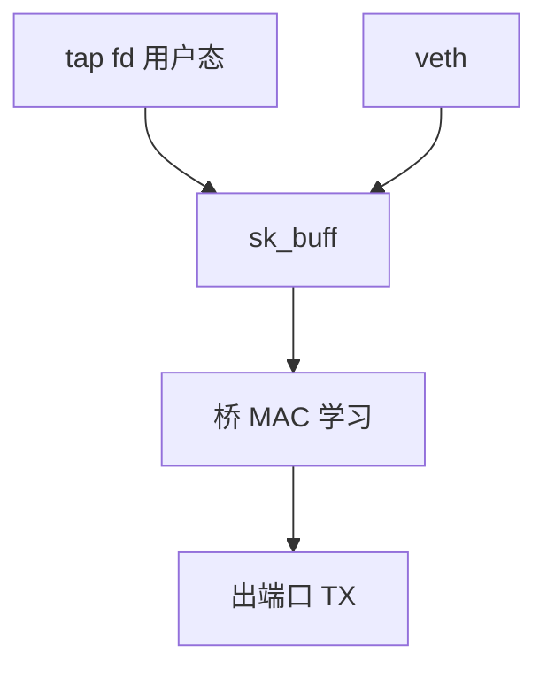

# 网桥与 tun / tap

网桥按 MAC 学习转发，把若干 net_device 收成一台虚拟交换机；tun 交 IP 包、tap 交以太网帧给用户态 fd。

<footer>—— 据 IEEE 802.1D 学习桥直觉；Linux bridge 与 tuntap 文档</footer>

[上一课](/cs/netns-veth)的 veth 要接到「交换机」才好多容器互通。缺口是 **bridge** 与 **tun/tap**：一个在内核转二层，一个把帧交给 qemu/VPN 用户态。

## 问题

桥：端口加入 `br0`，学 MAC 表，未知单播泛洪，STP 可选防环。与物理交换机同构，对象是 skb。tun：用户 `read`/`write` `/dev/net/tun` 得 IP 包（三层 VPN）；tap 带以太网头（虚拟机网卡）。缺口：桥接 tap 与 veth、VLAN 过滤、以及 [NAPI](/cs/napi) 在软件设备上的 `netif` 调用仍走同一 RX。本课不把 OVS 的流表写成另一门课。

MACVLAN 可避免桥的部分开销。本课以经典桥+tap 讲清对象。GRO 在软件设备上也可挂。

## 方法

`ip link add br0 type bridge`，把 veth 与 tap 设为 port。VM 写 tap → 内核 tap 驱动建 skb → 桥转发 → 另一端口 TX。对照 [device mapper](/cs/device-mapper-lvm)：dm remap 块号；桥 remap 的是「出哪口」。对照 [FUSE](/cs/fuse)：tun 是字符设备把包送用户，不是文件树。

## 机制

桥把 netns 里的多条虚线收成二层域；tun/tap 把「网卡」的另一头接到进程，这是虚拟机与 VPN 的 OS 接头。不要写成数据中心 fabric。与 netfilter：`br_netfilter` 可把桥转发再送进 iptables，性能与语义都坑，课序只要求知道钩可以叠。

隔离：VLAN 过滤与独立 netns 是不同层。

实现上：桥的 MAC 表老化后未知单播泛洪，容器网络会变成小广播域。tun 无以太网头，VPN 自己封装；tap 给虚拟机当网卡。br_netfilter 让桥包再进 iptables， entangle 二层与三层。 读法上只引用[上一课](/cs/netns-veth)的结论，不把对象换成训练推理或限价簿。

本课在操作系统进阶的「网络栈 / 收发路径」课序里，对象是 **网桥与 tun / tap**。

- 先修只引用，不重导：上一课的结论当公理，本课只补差。
- 五栏不吞并：不把本课写成大模型训练/推理，也不写成限价簿或权重量化。
- 文献用 OSTEP、McKusick、内核文档与具名会议论文；不发明 arXiv 编号。

## 边界

本课不引入 ebtables 的全部匹配。不保证无线桥接的 WDS 细节。下一课在驱动更早处处理包：XDP 与 eBPF 网络。

版本字段会变，课序钉的是机制对象「网桥与 tun / tap」，不是某一主线内核的结构体名。
后课默认：软件桥学 MAC；tun/tap 把帧交给用户。XDP 在 NAPI 前可编程收包，下一课。

## 小结

- 桥是内核虚拟交换机；tun/tap 是用户态包 fd。
- 容器与 VM 网络常靠 veth/tap+桥。
- XDP/eBPF 是下一课。
- 出处：Linux bridge；`tuntap(4)`；802.1D 直觉。
