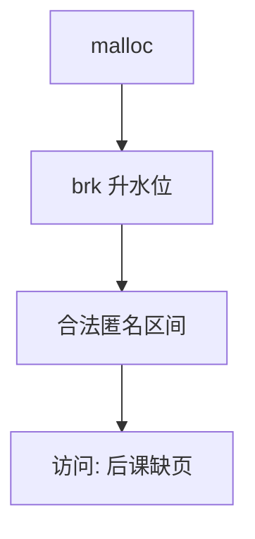

# brk 与堆

堆是用户空间里一块可伸缩的匿名区；brk 移动它的尽头，并不立刻为每一页准备物理帧。

<footer>—— 据 Bach, The Design of the UNIX Operating System；Silberschatz et al. 整理</footer>

[上一课](/cs/user-kernel-split)钉死用户/内核分界。[地址空间布局](/cs/addrspace-layout)说堆向高处长，还没有系统调用。[进程映像](/cs/process-image)的数据段之后那块空地，程序用 `malloc` 去填。缺口是内核看见的对象：**program break**，以及它只画出合法虚区间。

## 问题

若 `malloc` 每次向内核要一页物理内存，小对象会把系统调用打爆。若把整块堆一次配满物理页，虚大于物的后课策略没有空间。Unix 的选择：`brk`/`sbrk` 只改「堆尽头」这个水位；页表项可以仍无效。用户堆分配器在水位以内切块。缺口不是[分页](/cs/paging-vm)怎么填，而是谁有权把水位推高，以及推高后访问尚未备份的页会怎样——下一课才按需补页。

本课不把 glibc 的 arena 与 tcache 写成用户态教材。

当代 libc 大块常用匿名 `mmap`，小块仍可能走 `brk`。对内核，二者都是匿名 VMA；本课以 break 为原型，映射区留给 mmap 课。

## 方法

`brk` 把水位改到新地址：升高则增加合法区间，降低则放弃高端页（可拆页表）。内核检查不与栈、映射区、内核分界重叠，并受 `RLIMIT_DATA` 一类配额约束。此刻许多新页仍无帧。用户访问才触发缺页——那是下一课。`malloc` 失败可以是水位不许再升，也可以是稍后缺页时没有帧。

## 机制

堆把「语言运行时的对象图」接到 OS 的匿名区：GC 仍在用户态切块，内核只认 VMA。水位是进程私有的，`fork` 后各自一份；物理帧是否共享是后课 COW。与[栈](/cs/addrspace-layout)对照：栈可在故障时自动向下扩一页，堆通常要显式 `brk` 或 `mmap`，免得无意触碰把水位推过栈。

本课只保证：合法区间集合里多了一段匿名堆。帧从哪来、是否先填零，按需调页回答。

## 边界

本课不引入 `mallopt` 与 arena 调参，不把内核的 `vm_brk` 实现细节当考纲。也不把文件映射的堆（少见）写成默认。用户把 break 降到仍有指针指向的区域，是程序自己的释放协议，内核不追踪对象图。

后课默认：堆尽头已是合法虚地址。第一次访问这些页时如何分配帧，下一课按需调页。

## 小结

- `brk` 移动堆水位，画出合法匿名区间。
- 多数新页此刻无物理帧；补页是下一课。
- 大块匿名映射与 `brk` 同属匿名区，细节在 mmap。
- 出处：Bach, *UNIX*；Silberschatz et al., *OSC*；Tanenbaum *MOS*。
