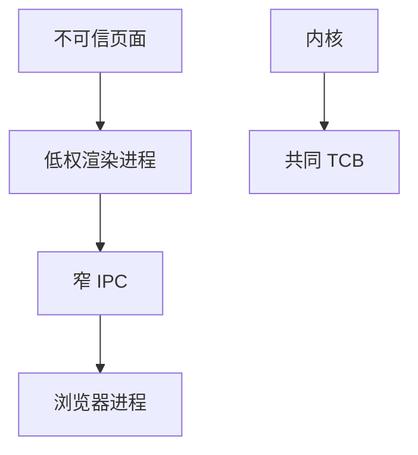

# 浏览器沙箱

渲染进程处理最脏的输入，应几乎没有系统调用权。沙箱是委派：内核强制的作业/seccomp/席位，加上进程间只传窄 IPC。假设渲染器会被打穿。

<footer>—— 据 Barth, Jackson and Reis 对浏览器安全的论述；Chromium 沙箱文档；对照 Reis 与 Google 的站点隔离</footer>

## 定位

上一课[sanitizer](/cs/sanitizers)在开发期抓洞。缺口是**运行期爆炸半径**：浏览器把不可信 HTML 当载荷。本课收多进程与系统调用过滤，不给逃逸步骤。

后课默认已经读完本课钉下的合同，只补差，不从该领域第一性原理重开。

## 问题

单进程浏览器里，页面洞等于全用户权。多进程：渲染器低权，浏览器进程持密钥与文件。站点隔离减少同源逃逸。缺口是权限最小化，不是再讲 JS 引擎优化。

### GPU 与插件

每个特权进程都是逃逸面。TCB 要清单化。

Chromium 设计文档公开。本课禁止沙箱逃逸教程。后课容器逃逸是另一隔离层。

## 方法

画：站点→渲染器（受限）→IPC→浏览器（特权）。对照 seccomp-bpf、Windows 作业对象。指出内核洞仍能逃——内核是共同 TCB。

图中节点是本课的机制骨架；课程不把图展开成可运行的攻击步骤。

## 机制

软件安全从「无洞」退到「有洞也不等于有整个机器」。下一课供应链：SBOM 与可复现，洞可能来自依赖而不是你的 C。

前提写进合同之后，游戏外的误用只当失败模式点名，不在本课写成操作程序。

## 边界

本课无逃逸 PoC。SBOM 与可复现构建下一课。

## 小结

- sanitizer 发现；沙箱限制渲染器权限。
- 假设渲染器被打穿；IPC 要窄。
- 内核仍是 TCB。
- 下一课 SBOM 与可复现构建。
- 出处：Barth, Jackson and Reis；Chromium sandbox；Reis et al. 站点隔离。
