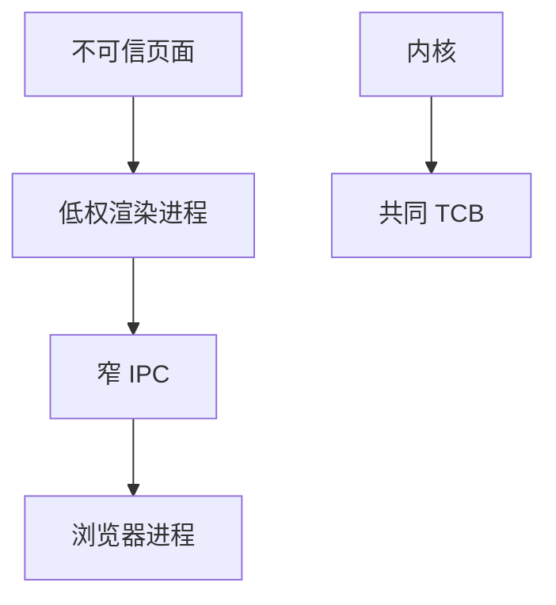
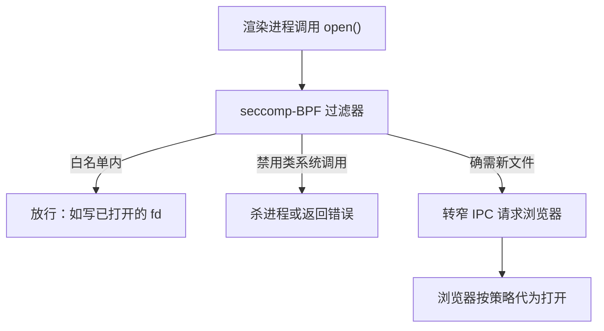

# 浏览器沙箱

渲染进程处理最脏的输入，应几乎没有系统调用权。沙箱是委派：内核强制的作业/seccomp/席位，加上进程间只传窄 IPC。假设渲染器会被打穿。

<footer>—— 据 Barth, Jackson and Reis 对浏览器安全的论述；Chromium 沙箱文档；对照 Reis 与 Google 的站点隔离</footer>

上一课[sanitizer](/cs/sanitizers)在开发期抓洞。缺口是**运行期爆炸半径**：浏览器把不可信 HTML 当载荷。本课收多进程与系统调用过滤，不给逃逸步骤。

后课默认已经读完本课钉下的合同，只补差，不从该领域第一性原理重开。

## 问题

单进程浏览器里，页面洞等于全用户权。多进程：渲染器低权，浏览器进程持密钥与文件。站点隔离减少同源逃逸。缺口是权限最小化，不是再讲 JS 引擎优化。

### GPU 与插件

每个特权进程都是逃逸面。TCB 要清单化。

Chromium 设计文档公开。本课禁止沙箱逃逸教程。后课容器逃逸是另一隔离层。

TCB（可信计算基）翻译过来就是「一旦它被骗，整道防线跟着失效」的那批组件清单。浏览器沙箱里，内核和持密钥的浏览器进程都在 TCB 内；渲染器再脏也不算——这正是「假设渲染器会被打穿」的含义：防线不押注在渲染器自身无洞上。

## 方法

画：站点→渲染器（受限）→IPC→浏览器（特权）。对照 seccomp-bpf、Windows 作业对象。指出内核洞仍能逃——内核是共同 TCB。

```mermaid
flowchart TD
  WEB["不可信页面"] --> REN["低权渲染进程"]
  REN --> IPC["窄 IPC"]
  IPC --> BR["浏览器进程"]
  KER["内核"] --> TCB["共同 TCB"]
```

直觉类比：沙箱像银行柜台。客户（渲染进程）隔玻璃办业务，手臂伸不进金库（系统调用被过滤）；要动文件必须填单走窄窗口（IPC），由柜员（浏览器进程）核对策略后代办——窗口越窄，可伪造的单据种类越少。

## 机制

软件安全从「无洞」退到「有洞也不等于有整个机器」。下一课供应链：SBOM 与可复现，洞可能来自依赖而不是你的 C。

下图回答一个具体问题：渲染进程发起一次被禁止的系统调用，各层分别如何响应。

```mermaid
flowchart TD
  SYS["渲染进程调用 open()"] --> F["seccomp-BPF 过滤器"]
  F -->|"白名单内"| OK["放行：如写已打开的 fd"]
  F -->|"禁用类系统调用"| KILL["杀进程或返回错误"]
  F -->|"确需新文件"| IPC["转窄 IPC 请求浏览器"]
  IPC --> POL["浏览器按策略代为打开"]
```

常见误区：初学者以为沙箱安全靠「渲染器没有漏洞」。实际前提恰好相反——设计时就默认渲染器已被打穿。安全来自：即使攻击者拿到渲染进程的任意代码执行，也没有能直接读文件、开网络的系统调用权，一切特权操作都要过窄 IPC 审核。

## 边界

本课无逃逸 PoC。SBOM 与可复现构建下一课。

## 小结

- sanitizer 发现；沙箱限制渲染器权限。
- 假设渲染器被打穿；IPC 要窄。
- 内核仍是 TCB。
- 下一课 SBOM 与可复现构建。
- 出处：Barth, Jackson and Reis；Chromium sandbox；Reis et al. 站点隔离。
