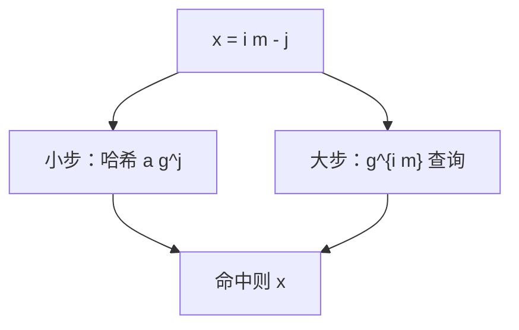

# BSGS 离散对数

$g^x=a$ 在阶 $n$ 的群里，拆 $x=i\lfloor\sqrt n\rfloor-j$，建小步表再大步查：$O(\sqrt n)$ 时间与空间。

<footer>—— 据 Shanks, Class Number, a Theory of Factorization and Genera, 1971；[离散对数](/cs/generator-discrete-log) 对照整理</footer>

上一课[欧拉函数与莫比乌斯](/cs/euler-mobius)给了模 $p$ 的阶相关函数。主干已定义离散对数。缺口是**算法**：Baby-step giant-step（BSGS）。不重写原根存在性。后课 Pollard rho 也可离散对数，本课先确定性根号。接[快速幂](/cs/fast-exponentiation)算 $g^k$。

## 问题

循环群 $\langle g\rangle$ 阶 $n$，$a\in\langle g\rangle$，求 $x$。令 $m=\lceil\sqrt n\rceil$，$x=im-j$，$0\le j<m$。则 $g^{im}=a g^{j}$。枚举 $j$ 存 $a g^j$（或 $g^j$）入哈希；枚举 $i$ 算 $g^{im}$ 查询。时间空间 $O(\sqrt n)$。

缺口是时间–空间折中，不是 NP 证书。Pohlig–Hellman 先把 $n$ 分解成小素因子再 CRT，点名。

### 不是线性筛那种 $O(n)$

$n$ 是群阶，可 $2^{256}$，根号仍不可行。本课算法在 $n\approx 10^{12}$ 量级可谈。密码学离散对数要亚指数（NFS），不在本课。

Shanks BSGS。Pollard rho 离散对数均摊同阶、空间更小。后课 rho 主讲分解，对数变体点名。

## 方法

确定 $n$（或倍数）。建小步哈希。大步乘 $g^m$。注意 $j$ 的符号约定与空解。

群运算须能哈希元素。

## 机制

任何 $x\in[0,n)$ 必有一种 $i,j$ 拆法。哈希期望 $O(1)$。与穷举 $O(n)$ 比根号。与 BSGS 矩阵离散对数（Baby-step 在 GL）点名不同群。

## 边界

本课不写 index calculus。不写椭圆曲线专用（仍可用 BSGS，阶不同）。后课默认：小阶离散对数 BSGS $O(\sqrt n)$。下一课 Pollard rho 分解。

## 小结

- 大步小步 $O(\sqrt n)$ 时间空间。
- 须知阶（或上界）。
- 大阶密码实例不靠本课。
- 出处：Shanks, 1971。
