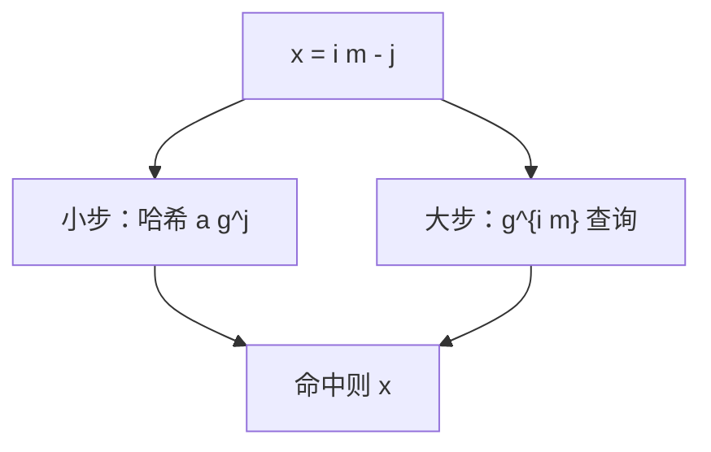

# BSGS 离散对数

$g^x=a$ 在阶 $n$ 的群里，拆 $x=i\lfloor\sqrt n\rfloor-j$，建小步表再大步查：$O(\sqrt n)$ 时间与空间。

<footer>—— 据 Shanks, Class Number, a Theory of Factorization and Genera, 1971；[离散对数](/cs/generator-discrete-log) 对照整理</footer>

上一课[欧拉函数与莫比乌斯](/cs/euler-mobius)给了模 $p$ 的阶相关函数。主干已定义离散对数，接[快速幂](/cs/fast-exponentiation)算 $g^k$。缺口是**算法**：Baby-step giant-step（BSGS）。不重写原根存在性。后课 Pollard rho 也可离散对数，本课先讲确定性根号。

## 问题

循环群 $\langle g\rangle$ 阶 $n$，$a\in\langle g\rangle$，求 $x$ 使 $g^x=a$；穷举 $O(n)$。BSGS 把指数切成两半：令 $m=\lceil\sqrt n\rceil$，任何 $x\in[0,n)$ 都可写成 $x=im-j$，$0\le i,j\lt m$（$j$ 放负号一侧，等式 $g^{im}=ag^{j}$ 两侧就都只剩能快速算的量）。于是小步枚举 $j$，把 $ag^j$ 连同 $j$ 存入哈希；大步枚举 $i$，从 $g^0$ 起每步乘 $g^m$ 查表，命中即 $x=im-j$。时间空间 $O(\sqrt n)$。

缺口是时间–空间的折中，不是 NP 证书。Pohlig–Hellman 走另一头：把 $n$ 分解成小素因子、在小子群解、再 CRT 合并——点名。

### 不是线性筛那种 $O(n)$

这不像线性筛把 $O(n)$ 压成亚线性：$n$ 是群阶，密码实例可达 $2^{256}$，开根号也毫无希望。BSGS 的适用域是 $n$ 在 $10^{12}$ 量级内可谈的场景；密码学大阶离散对数要亚指数（NFS），不在本课。

Shanks BSGS。Pollard rho 离散对数均摊同阶、空间更小。后课 rho 主讲分解，对数变体点名。

## 方法

四步：确定 $n$（或其已知倍数，代价相应放大）；定 $m$ 建小步哈希，重复元素保留最小 $j$；大步维护 $g^{im}$ 逐次乘 $g^m$ 查表；扫完无命中即无解。注意 $j$ 的符号约定别在实现里写反。群运算须能哈希元素——模素数乘法群天然可以，任意群要给规范表示。

```mermaid
flowchart TD
  X["x = i m - j"] --> BABY["小步：哈希 a g^j"]
  X --> GIANT["大步：g^{i m} 查询"]
  BABY --> HIT["命中则 x"]
  GIANT --> HIT
```

群运算须能哈希元素。

## 机制

正确性在拆分定理：任何 $x\in[0,n)$ 必有一种 $i,j$ 拆法（$i$ 取上取整、$j=im-x$ 均在界内），两份长度 $\sqrt n$ 的表必然在解处相交。哈希期望 $O(1)$ 查询撑住复杂度；与穷举 $O(n)$ 比降到根号，代价是 $O(\sqrt n)$ 空间——这也是与后课 rho 的分工：时间同阶而空间常数级。矩阵群（如 GL）上的离散对数有同名的 baby-step/giant-step 变体，点名即可，不同群代价不同。

## 边界

本课不写 index calculus。椭圆曲线群没有 index calculus，但 BSGS 照样可用，只是阶的形状不同。后课默认：小阶离散对数 BSGS $O(\sqrt n)$。下一课 Pollard rho 分解。

## 小结

- 大步小步 $O(\sqrt n)$ 时间空间。
- 须知阶（或上界）。
- 大阶密码实例不靠本课。
- 出处：Shanks, 1971。
