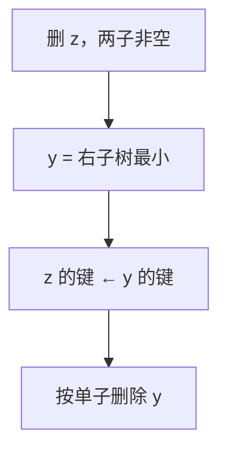

# BST 删除与后继

有两个孩子的节点不能直接剪掉；中序后继顶上去，查找树的左右序才还在。

<footer>—— 据 Cormen, Leiserson, Rivest and Stein, Introduction to Algorithms 第 12 章；Knuth, TAOCP 卷 3 整理</footer>

[上一课](/cs/bst)钉了 BST 不变式、查找与插入，并承认删除分三支、双子要找后继，却未把后继与拼接写完。本课不重讲「小走左、大走右」。缺口是删除保持中序序列：叶与单子是改一条边；双子用后继（或前驱）的键顶替，再删后继——后继最多一个孩子。平衡仍不进场；最坏仍可成链。

## 问题

删叶：父的对应孩子置空。删只有一棵子树的节点：父改接到那棵子树。删两个孩子的 $z$：若直接把左右子树随便挂到父上，中间那些键与 $z$ 的父的序会乱。缺口不是旋转，而是**中序后继 $y$：右子树中最小，即从右孩子一路向左**。$y$ 没有左孩子。把 $y$ 的键写入 $z$（或把 $y$ 摘下接到 $z$ 的位置），再按单子情况删 $y$ 的原位。

后继也是「下一个更大键」查询的实现，字典合同需要它，不只为删除。

用前驱（左子树最大）对称。实现选一侧即可；后课 AVL 删除同样先做 BST 删除再旋转。

## 方法

`Tree-Successor(x)`：若 `x.right` 非空，沿左下到尽头；否则沿父上走，直到自己是左孩子。无父指针则删除时从根一路记下路径，或在找 $z$ 时同时找后继。

卫星数据：若卫星跟着键走，复制键时要复制卫星，或改指针拓扑使 $y$ 节点占据 $z$ 的位置，避免大对象拷贝。不变式只关心键序。

## 机制

一次删除 $O(h)$ 步：查找 $z$、找 $y$、改常数指针。$h$ 无界时与查找同病。删除不自动降低最坏高度——删叶甚至可能让链更「瘦」但仍是链。这是 AVL 课的动机：旋转在删后恢复高度差。

与链表删除不同：BST 不能只靠 `prev/next` 绕过，除非另维护中序线索；标准树上后继可能要上爬。

## 边界

本课不引入惰性删除（只打标记），不处理重复键的哪一个被删。也不把红黑的双黑修复写进来。父指针可选；CLRS 用父指针写 successor。

后课默认：BST 删除保持中序；双子走后继。高度仍无保证，必须平衡。

## 小结

- 叶/单子改指针；双子用中序后继顶替再删后继。
- 后继 = 右子最小，或沿父上爬。
- 复杂度 $\Theta(h)$；下一课 AVL 用旋转钉 $h=\Theta(\log n)$。
- 出处：Cormen et al. 第 12.3 节；Knuth, *TAOCP* 卷 3。
