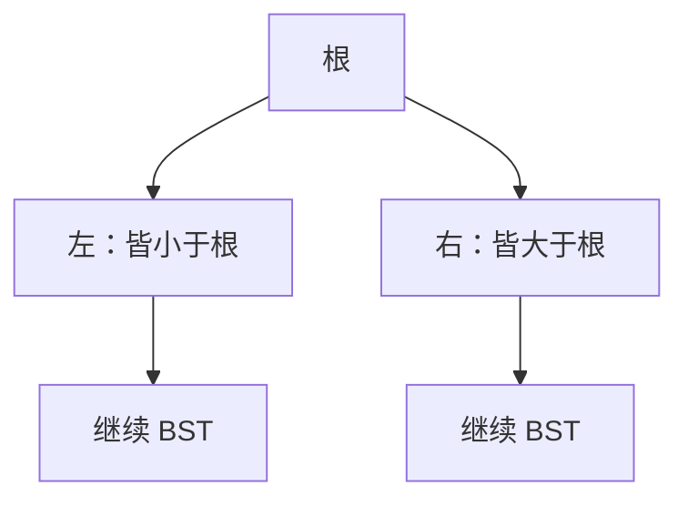

# 二叉查找树

左子树都小于根、右子树都大于根，查找就沿着一条根到叶的路径走，步数等于高度。

<footer>—— 据 Cormen, Leiserson, Rivest and Stein, Introduction to Algorithms；Knuth, TAOCP 卷 3 整理</footer>

[上一课](/cs/amortized-analysis)让动态数组的端操作摊还 $\Theta(1)$。按下标已经解决；按键查找在无序数组或链表上仍是 $\Theta(n)$。[树作为无环连通图](/cs/tree-as-acyclic)已经有树。[渐近记号](/cs/asymptotic-notation)把高度写成 $h$。本课不重讲摊还。缺口是有序字典的第一种树表示：二叉查找树（BST）不变式，查找/插入沿比较路径。平衡不在本课。

## 问题

数组有序可用二分，但插入要搬移。链表插入廉价，不能二分。缺口是：节点带左右孩子，**中序遍历恰好是键的排序**，从而比较一次丢掉一边。合同：查找、插入、删除与后继。

没有平衡时，$h$ 最坏 $n$（插成链），最坏查找 $\Theta(n)$，退回链表。本课必须把这个边界说清，否则后课 AVL 没有动机。

随机插入下期望高度 $O(\log n)$，那是期望分析，不是最坏合同。本课最坏按 $h$ 写。

## 方法

节点：键、可选卫星数据、左、右、可选父。不变式：左子树键 $\lt $ 根 $\lt $ 右子树键（或非严格，须统一）。查找：从根比较，小走左、大走右，空则失败。插入：失败路径的空位挂新叶。

删除分三支：叶、单子、双子（用后继顶替）。本课承认双子删除要找后继，不把所有旋转请进来。

## 机制

中序遍历在 $\Theta(n)$ 内输出有序列，这是链表扫不到的「有序」加树结构。字典操作复杂度 $\Theta(h)$，不是 $\Theta(\log n)$，除非另证 $h$。后课旋转保持不变式同时降 $h$。

与[局部性原理](/cs/locality-principle)：指针树同样追逐；节点池或 B 树才会把比较装进 cache 行。本课先保证正确性。

## 边界

本课不引入红黑位、不引入 AVL 平衡因子。也不把 BST 当成优先队列——无序堆更适合「只要最小」。重复键、卫星数据的相等策略须事先约定。

后课默认：有序字典可以放在 BST 里，代价随高度。高度无保证时，必须平衡。

## 小结

- BST 不变式让比较丢掉一边；步数是高度 $h$。
- 最坏 $h=\Theta(n)$；期望随机插入才对数。
- 旋转维持不变式并降高，是下一课 AVL。
- 出处：Cormen et al. 第 12 章；Knuth, *TAOCP* 卷 3。
